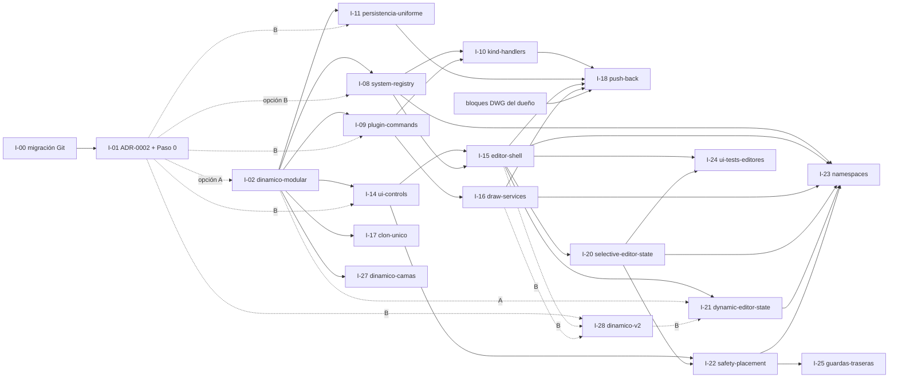

# ROADMAP — plan de ejecución por fases e iniciativas

> Actualizado: 2026-07-20 (I-13 integrada y validada en `main`; la decisión documental de I-29
> quedó aplicada por I-13).
> Convierte la
> [auditoría 2026-07](auditoria-arquitectura-2026-07.md) en un plan ejecutable por iniciativas
> independientes (1 iniciativa = 1 rama = 1 worktree, ver [WORKFLOW.md](WORKFLOW.md)).
> Jerarquía de "qué sigue": **este documento = el plan**; HANDOFF §11 = lo inmediato;
> ideas-futuras.md = backlog largo y deuda diferida.
>
> Cómo se usa: el estado "en curso" NO se anota aquí — se deriva de la existencia de la rama en
> origin (`git fetch && git branch -r`). Este archivo se edita SOLO en la sesión de integración
> (último commit de la rama, WORKFLOW §4.5.4): la columna Estado pasa de `pendiente` a
> `integrada (fecha)` o `descartada (fecha, motivo)`. Sin hashes aquí (viven en HANDOFF §12).
> Al cerrar una fase completa, sus filas integradas se mueven a la sección "Cerradas" del final.

## Principios del plan

1. **El trunk siempre funciona.** Ninguna fase deja el plugin a medias; cada iniciativa se integra
   completa o no se integra.
2. **Nada de big-bang.** Los refactors grandes de la auditoría se partieron en iniciativas de 1-3
   sesiones; si una crece más, se parte otra vez.
3. **Strangler, no reescritura**: lo nuevo se construye junto a lo viejo, los consumidores migran
   uno a uno, y lo viejo se borra al final.
4. **La validación humana es el cuello de botella y se administra**: máximo 1-2 iniciativas
   esperando validación en AutoCAD a la vez; si la cola crece, las pistas pausan integraciones (no
   producción). Los refactors "que preservan comportamiento" (I-09, I-16, I-23) reducen esa carga
   con **tests golden de equivalencia de planes** (snapshot del plan de bloques antes vs después,
   patrón que ya existe en los tests "ARRAY == plano"): la validación humana queda en muestreo.
5. **Push Back es la prueba de fuego** de la arquitectura nueva: si su alta exige editar código de
   otros sistemas, la Fase 2-3 quedó incompleta (consumir contratos compartidos SÍ está permitido).
6. Las decisiones que condicionan fases van a [ADR](adr/README.md) ANTES de implementarse.
7. **"Independiente" = sin dependencias previas; los estorbos declarados siguen aplicando.** Una
   iniciativa de relleno solo arranca si sus estorbos no están en curso (WORKFLOW §2).

## Fases

| Fase | Nombre | Objetivo | Criterio de salida |
|---|---|---|---|
| 0 | Preparación del proyecto — **CERRADA (2026-07-17)** | Proceso sano: trunk real, CI, flujo nuevo, decisión del dinámico | CUMPLIDO: main = trunk protegido; ADR-0002 aceptado (opción A, tras su Paso 0); cero ramas zombie |
| 1 | Robustez y limpieza | Cerrar riesgos latentes baratos + resolver la rama del dinámico | I-02 resuelta; fallos diagnosticables; docs reestructurados; I-13 concluido |
| 2 | Arquitectura base + producto dinámico | Contratos/registros que abaratan el sistema N+1 (la brecha cama↔dinámico quedó cerrada por I-02) | Alta de un Kind sin tocar stores/switches; persistencia uniforme (I-27 quedó absorbida por I-02) |
| 3 | Componentes reutilizables | UI y Plugin componibles (controles, shell, draw service genérico) | Un editor nuevo cuesta ~300 líneas; rejilla de seguridad única |
| 4 | Primer sistema nuevo | Push Back sobre la arquitectura nueva + guía validada | Push Back completo sin editar código de otros sistemas |
| 5 | Migración progresiva | Los sistemas existentes adoptan la arquitectura, uno a uno | Editores migrados al shell; namespaces finales; lista de archivos calientes reducida |

Las fases se traslapan donde las dependencias lo permiten: la pista de UI (I-14→I-15) puede correr
en paralelo con la Fase 2 de Application porque tocan capas distintas.

## Iniciativas

Tamaño: S = 1 sesión, M = 2-3 sesiones, L = partir antes de ejecutar. "Se estorba con" = no correr
en paralelo con esa iniciativa (mismos archivos). ✋ = requiere validación del dueño en AutoCAD al
cerrar (cuenta contra la cola del principio 4).

### Fase 0 — Preparación — CERRADA (2026-07-17)

Sus dos iniciativas quedaron integradas y sus filas viven en la sección "Cerradas" del final.
Resultado: `main` trunk protegido, flujo por iniciativas operando, **ADR-0002 aceptado con la
opción A** (evidencia en `adr/0002-paso0-evidencia.md`), cero ramas zombie.

### Fase 1 — Robustez y limpieza

| ID | Iniciativa (rama) | Qué incluye (hallazgos) | Tamaño | Depende de | Se estorba con | Estado |
|---|---|---|---|---|---|---|
| I-02 | `feature/dinamico-modular` ✋ | **ADR-0002=A ejecutada**: tag de resguardo sobre la punta validada, rama renombrada (ADR-0001), rebase sobre el trunk conservando los arreglos de main (los conflictos fueron solo los 7 docs previstos), catálogos append-only intactos, suite + builds + CI + **re-validación AutoCAD sobre el árbol rebasado** completas (HANDOFF §8-12). Estabilizada en 1 de las 3 sesiones permitidas; la contingencia (opción B) no se activó. Absorbe I-27 | M-L | I-01=A (cumplida) | I-08, I-09, I-11, I-14, I-16, I-17 (quedaron desbloqueadas al integrarse) | integrada (2026-07-17) |
| I-03 | `refactor/fallos-silenciosos` | Logger mínimo a `%AppData%\RackCad\logs`; los 14 catch del Plugin + los de Persistence registran; `Report()` con stack; aviso de catálogo vacío; escritura atómica temp+`File.Replace` en los 4 stores; carga distingue "no existe" de "ilegible" (P1, D2) | M | — | I-11 | pendiente |
| I-04 | `fix/install-bundle-preserva-datos` | Instalación transaccional con validación previa, staging, respaldo y rollback; reemplaza catálogos CSV/JSON de producto sin fusionarlos, preserva `blocks-library.dwg` byte por byte y regenera un bundle limpio/reproducible (G7) | S | — | — | integrada (2026-07-17) |
| I-05 | `feature/guardrail-unidades` ✋ | Leer `INSUNITS` al insertar/RACKLAYOUT/RACKRELLENAR y avisar si ≠ pulgadas; ADR de estrategia de unidades a largo plazo (D4) | S | — | — | pendiente |
| I-06 | `docs/reestructura` | Entregó `ARCHITECTURE.md`, nueve Context Packs, glosario y guías vigentes, archivo histórico, HANDOFF reducido y automatización documentada pero pausada; preservó el contenido único y corrigió rutas y navegación. I-07 se desbloquea solo tras el merge efectivo | M | — | I-07 | integrada (2026-07-17) |
| I-07 | `docs/adr-retroactivos` | Retro-documentar las ~13 decisiones de HANDOFF §7 como ADRs de una página (C4) | S | — | I-06 | pendiente |
| I-13 | `architecture/referencias-autocad-ci` | Promovió la evidencia conservada en `archive/i-13-experiment-final-4e084d2` a un build limpio del Plugin sin AutoCAD en CI: referencias condicionales compile-only, versiones/hashes/origen fijados, guardas fail-closed, bundle y artifacts sin material Autodesk. ADR-0003 acepta la excepción cero-NuGet limitada conforme a I-29 | S | — | — | integrada (2026-07-20) |
| I-26 | `refactor/test-catalog-ids` | `TestCatalogIds` centralizados; guardián de IDs y relaciones esenciales contra los catálogos distribuidos; cobertura Cobertura publicada como artifact de CI | S | — | — | integrada (2026-07-19) |
| I-29 | `docs/licencia-procedencia-autocad-ci` | Decisión B: aprobada con restricciones para uso interno de RackCad como aceptación interna de riesgo; no es conclusión jurídica ni autorización expresa de Autodesk. Sus catorce restricciones y revisión obligatoria quedaron aplicadas en ADR-0003 | S | — (usa evidencia técnica de I-13) | — | integrada por I-13 (2026-07-20) |

### Fase 2 — Arquitectura base + producto dinámico

| ID | Iniciativa (rama) | Qué incluye (hallazgos) | Tamaño | Depende de | Se estorba con | Estado |
|---|---|---|---|---|---|---|
| I-08 | `architecture/system-registry` | Descriptor de sistema + `SystemRegistry` en Application; `RackProjectStore`/validación/`RackDesignLibrary` consumen el registro (mueren los 3 switches y el enum paralelo) (E1) | M | I-02 (integrada 2026-07-17) | I-10, I-11 | pendiente |
| I-09 | `refactor/plugin-commands` | Partir `RackFrameCommands` en clases por área; promover helpers a `RackBlockFinder`/`RackCloner`/`LayerHelper`; unificar el escaneo de envelopes triplicado; helpers `InDocumentTransaction`. Sin cambio de comportamiento: diff mecánico revisable (P2, P5) | M | I-02 (integrada 2026-07-17) | I-10, I-16 | pendiente |
| I-10 | `architecture/kind-handlers` | `IRackKindHandler` + registro en el **Plugin** (pista Plugin, no Application); RACKEDITAR/RACKBOMTOTAL/RACKLAYOUT/restamp despachan por registro; Kind no registrado = error visible (E2) | M | I-08, I-09 | I-09, I-16 | pendiente |
| I-11 | `architecture/persistencia-uniforme` | `FlowBedDocument`/`LargueroDocument` versionados con lectura legacy; versión de app en el envelope del Xrecord; preservar campos desconocidos al re-guardar (D1, D3) | M | I-02 (integrada 2026-07-17) | I-03, I-08 | pendiente |
| I-12 | `refactor/versionado` | `<Version>` única en Directory.Build.props + SHA estampado; `PackageContents.xml` generado; bundle por `dotnet publish`; centralizar LangVersion/Nullable en Build.props; **ADR corto "estrategia de versiones de AutoCAD"** (SeriesMax, política de recompilación anual — AutoCAD 2026/2027 llegan dentro del horizonte del plan) (G5, G8, G9) | S-M | — | — | pendiente |
| I-27 | `feature/dinamico-camas` ✋ | **Absorbida por la implementación dinámica de I-02**: la cama de rodamiento quedó integrada dentro del dibujo del sistema dinámico (`DynamicFlowBedLateralBuilder` compone `FlowBedLateralBuilder` sin duplicarlo; BOM con componente `Cama` sin despiece), validada en pruebas y en AutoCAD, y la línea "Fuera de alcance" del README quedó actualizada. También cumplió la prueba temprana de composición entre sistemas que I-18 necesitará. Sin alcance restante — no se mantiene como iniciativa separada | M | I-02 (la absorbió) | — | integrada por I-02 (2026-07-17) |

### Fase 3 — Componentes reutilizables

| ID | Iniciativa (rama) | Qué incluye (hallazgos) | Tamaño | Depende de | Se estorba con | Estado |
|---|---|---|---|---|---|---|
| I-14 | `architecture/ui-controls` | `SelectionMatrix` (mata las rejillas duplicadas: 3 hoy, 5-6 tras I-02), `NumericField`, `CatalogCombo`, clase base `RackDialogWindow`, `PreviewCanvas` con proyección/paleta compartida. **Incluye crear `tests/RackCad.UI.Tests` (net8.0-windows) + su job de CI: los controles nacen con tests** (U5-U7, parte de U3) | M | I-02 (integrada 2026-07-17) | I-15, I-17 | pendiente |
| I-15 | `architecture/editor-shell` | `RackEditorSession` (catálogo, identidad, Recompute coalescido, contrato de inserción) + `IRackEditorModule` + registro de módulos que el menú y la biblioteca consumen (mata las 13 propiedades O(N)) (E3, E5, U1 parcial) | M | I-08, I-14 | I-14 | pendiente |
| I-16 | `refactor/draw-services` | `ViewBlockDrawService` genérico (colapsa los DrawServices idénticos: 5 hoy, 7 tras I-02); extraer `BlockPlacementService` + catálogo de `LateralHeaderDrawService`; uniformar `regen`. **Con tests golden de equivalencia de planes** (E4, P3) | M | I-09 | I-09, I-10 | pendiente |
| I-17 | `refactor/clon-unico-cabecera` | Un solo deep-clone de `RackFrameConfiguration` vía store de serialización; borrar las 3 copias de la UI (VM del configurador, selectivo, dinámico) + test de equivalencia (U4). **No es relleno: toca 2 archivos calientes y un archivo que I-02 reescribe** | S | I-02 (integrada 2026-07-17) | I-14; no en paralelo con trabajo en selectivo/configurador | pendiente |

### Fase 4 — Primer sistema nuevo

| ID | Iniciativa (rama) | Qué incluye | Tamaño | Depende de | Se estorba con | Estado |
|---|---|---|---|---|---|---|
| I-18 | `feature/push-back` ✋ | Push Back como PRIMER módulo del patrón nuevo: descriptor + documento versionado + resolver/builders → SystemPlan + BOM + editor sobre el shell + draw adapter genérico, **componiendo lo compartido que ya existe** (la cama `FlowBedType.Pushback` del código actual). Al cerrar: `guias/agregar-un-sistema.md` validada por la experiencia real. **Prerequisito humano calendarizado: el dueño dibuja los bloques DWG de Push Back y define sus filas de catálogo ANTES de arrancar** (referencia de costo: una sola familia de desviadores exigió 21 bloques y una sesión de validación) | L (partir al diseñarla) | I-10, I-11, I-15, I-16 + bloques DWG del dueño | — | pendiente |
| I-19 | `feature/validador-catalogos` | Validador con severidades (ids duplicados, FKs, bloques/vistas faltantes, filas descartadas por rol con aviso) + manifest de blocks-library.dwg (ideas-futuras #14/#15). Conviene cerca de I-18 (mete filas nuevas al catálogo) | M | — | — | pendiente |
| I-28 | `feature/dinamico-v2` ✋ | **Solo si un ADR futuro reemplaza a ADR-0002 por la opción B** (contingencia de I-02; ADR-0002 quedó aceptado con A el 2026-07-17): re-implementar el dinámico modular sobre el registro y el shell, usando la rama archivada como referencia de requisitos; absorbe el alcance de I-27 | L | ADR nuevo que reemplace ADR-0002, I-15, I-16 | I-21 | condicional |

### Fase 5 — Migración progresiva (serializar las del mismo subsistema)

| ID | Iniciativa (rama) | Qué incluye | Tamaño | Depende de | Se estorba con | Estado |
|---|---|---|---|---|---|---|
| I-20 | `refactor/selective-editor-state` | Extraer `FondoMatrix`/`Cell`/`ApplyScope`/`BuildDesign` a Application (testeables); la ventana queda observando/pintando (U1, U3) | M | I-15 | I-22 (orden fijo: I-20 primero) | pendiente |
| I-21 | `refactor/dynamic-editor-state` | Ídem para el editor dinámico (~3,318 líneas si A; 1,332 si B). Partir por vistas si excede | M-L | I-15 + I-02 (A ejecutada e integrada; I-28 solo si un ADR futuro reemplaza ADR-0002) | I-28 | pendiente |
| I-22 | `refactor/safety-placement` | Servicios de colocación por familia (Tope/Parrilla/Tarima…) parametrizados por vista; subtipos de `SelectiveSafetySelection` con DTO por subtipo; paso de troquel en UNA constante; las rejillas adoptan `SelectionMatrix` (E6, E7) | M | I-14, I-20 (orden fijo) | I-20 | pendiente |
| I-23 | `refactor/namespaces-sistemas` | `Systems.Selective/Dynamic/FlowBed/Shared`; renombres fósiles (`Headers`→`Drawing`, `DynamicSystemPlan`→`SystemPlan`); .editorconfig — mecánico, con tests golden, **cierra la Fase 5: depende de TODAS las demás** (E8) | M | I-08, I-15, I-16, I-20, I-21, I-22 | toda la Fase 5 | pendiente |
| I-24 | `refactor/ui-tests-editores` | Tests de ViewModels y estados de editor sobre `tests/RackCad.UI.Tests` (el proyecto nace en I-14) (U3) | S | I-15, I-20 | — | pendiente |
| I-25 | `feature/guardas-traseras` ✋ | Última familia de seguridad (prioridad final del producto), construida sobre I-22 | M | I-22 | — | pendiente |

Backlog no planificado (sigue en ideas-futuras.md): cotizador, pesos, anclas, tabla-resumen en el
dibujo, snapping, colisiones, clear height, undo/redo, shop drawings, 3D/IFC, optimizador IA, SQL/API
(cuando lleguen: sus stores nacen instanciables tras interfaz).

## Dependencias (grafo)

Aristas = "depende de" (los estorbos viven en las tablas). Las aristas punteadas eran condicionales
según ADR-0002; **la opción A quedó aceptada el 2026-07-17**, así que rigen las aristas A y las
aristas B solo aplicarían si un ADR futuro reemplaza a ADR-0002 (contingencia de I-02).



Sin dependencias previas (pero sus estorbos aplican — principio 7): I-03 (estorba I-11),
I-05, I-06/I-07 (se estorban entre sí), I-12 e I-19.

## Orden recomendado y paralelismo (para 2-3 IAs simultáneas)

```
Semana 0:      I-00 + I-01 (dueño; Paso 0 de ADR-0002 incluido; bloquea todo)
Fase 1:        I-02 e I-13 integradas — I-08/I-09/I-11/I-14/I-16/I-17 quedaron desbloqueadas
               I-04 e I-26 integradas; relleno restante: I-03 e I-05
               Docs: I-06 integrada → I-07 desbloqueada
Fase 2/3:      Pista A (Application): I-08 → I-11
               Pista B (Plugin):      I-09 → I-16 → I-10   ← serializadas: se estorban entre sí
               Pista C (UI):          I-14 → I-15
               (La pista de producto I-27 quedó absorbida por I-02: la cama ya está integrada)
               Relleno: I-12, I-17 (tras I-02 y sin trabajo paralelo en selectivo/configurador), I-19
Fase 4:        I-18 (Push Back; su prerequisito de bloques DWG arranca ANTES, en Fase 2-3)
               (si ADR-0002=B: I-28 sustituye/precede a I-18 como primer gran módulo)
Fase 5:        I-20 → I-22 → I-25; I-21; I-24; I-23 AL FINAL (depende de todas)
```

Reglas de asignación: cada pista toca UNA capa (I-10 es Plugin y corre en la pista B, al final);
las iniciativas ✋ comparten la cola de validación del dueño (máx. 1-2 pendientes a la vez,
principio 4); una iniciativa de relleno solo arranca si sus estorbos no están en curso.

## Re-validación de las recomendaciones de la auditoría (2026-07-16)

| Recomendación de auditoría | ¿Válida? | Cambio en esta fase |
|---|---|---|
| 1. Orden de casa Git | Sí | Ahora incluye retirar `claude/*`/`codex/*` (ADR-0001) y el barrido documental del retiro de `release/claude-review`; queda como I-00 |
| 2. Decidir dinámico-modular | Sí, **sigue siendo el gate** | Formalizada como ADR-0002 con **Paso 0 nuevo** (probar la rama en AutoCAD: la evidencia que decide A/B no existía). El diff real de la rama amplió su radio: I-09/I-14/I-16/I-17 también esperan |
| 3. CI mínimo | Sí | Ya committeado; activarlo pasa a I-00. Trigger simplificado a todo push (una lista de ramas duplicada en ci.yml divergía de WORKFLOW) |
| 4. Flujo multi-agente | Sí, con cambio mayor | **Ramas por iniciativa** (ADR-0001); sin `wip/*` (apertura = commit vacío de reclamo con Claim-Id + push sin force: el primer push aceptado reclama; push al cerrar cada sesión = respaldo); integración serializada con rebase + `--force-with-lease` + `--no-ff`; HANDOFF/ROADMAP solo en la sesión de integración (se corrigieron AGENTS/CLAUDE que decían lo contrario) |
| 5. Guardrail INSUNITS | Sí | Adelantada a Fase 1 (I-05) |
| 6. Logging + escrituras atómicas | Sí | Juntas en I-03 (mismo tema, mismos archivos) |
| 7. Fix install-bundle | Sí | Integrado con staging, respaldo, rollback y preservación del DWG (I-04, 2026-07-17) |
| 8. Registro de sistemas | Sí | **Dividida en 2** (I-08 Application, I-10 Plugin); I-10 corre en la pista Plugin DESPUÉS de I-09/I-16 (se estorban) |
| 9. Editor Shell | Sí | **Dividida en 3**: controles (I-14, que además crea el proyecto de tests de UI), shell (I-15), y extracción de estado por editor en Fase 5 (I-20/I-21) |
| 10. DrawServices + comandos | Sí | Dividida en I-09 → I-16 (misma pista, serializadas); ambas con red de tests golden de equivalencia |
| 11. Persistencia uniforme | Sí | Retrasada hasta resolver ADR-0002 (la rama reescribe esos documentos); dependencia condicional A/B explícita |
| 12. Colocación por familia + subtipos | Sí | Fase 5 (I-22), con orden fijo tras I-20 (tocan el mismo código del selectivo) |
| 13. Des-duplicación documental | Sí | I-06 con alcance ampliado: barrido de referentes y mapeo del contenido único de 03 en la misma rama |
| 14. Refs AutoCAD para CI | Sí | **Integrada por I-13**: el experimento fue promovido limpiamente y CI compila el Plugin sin AutoCAD bajo ADR-0003 y las restricciones de I-29 |
| 15. Versionado real | Sí | I-12 absorbe además el ADR de estrategia de versiones de AutoCAD (SeriesMax/ciclo anual: cita con fecha conocida dentro del horizonte del plan) |
| BAJA: namespaces | Sí | I-23 **cierra la Fase 5** (depende de todas las migraciones, no solo de I-08/I-15/I-16) |
| BAJA: Nullable/editorconfig | Sí, matizada | Nullable=enable para proyectos nuevos entra con I-12; .editorconfig con I-23 |
| BAJA: TestCatalogIds + coverage | Sí | I-26 integrada: IDs test-only, guardián canónico y artifact Cobertura |
| BAJA: validador catálogos + manifest | Sí | Subida a Fase 4 (I-19), cerca de Push Back |
| BAJA: ADR costos / limpieza assets | Sí | Siguen en backlog (ideas-futuras); el ADR de costos se dispara cuando el cotizador entre al plan |
| — (nuevo, de la crítica) | — | **I-27 `feature/dinamico-camas`**: la prioridad #1 de producto no tenía iniciativa — el plan la omitía y ROADMAP se declara "el plan". Finalmente quedó absorbida por I-02: la implementación dinámica integró la cama |
| — (nuevo, de la crítica) | — | **I-28 `feature/dinamico-v2`** (condicional): la opción B de ADR-0002 no estaba modelada — I-11/I-21 quedaban con dependencias colgantes |

## Arquitectura documental objetivo (se ejecuta en I-06)

```
README.md                  1 pantalla: qué es, build, NETLOAD, comandos → enlaces
AGENTS.md                  convenciones obligatorias (código, arquitectura, terminado)
CLAUDE.md                  índice de arranque para IAs
docs/
  HANDOFF.md               estado vivo (ÚNICO lugar con conteos/fechas/hashes)
  WORKFLOW.md              proceso: ramas, worktrees, integración, multi-IA
  ROADMAP.md               este plan (fases, iniciativas, dependencias, estado)
  ARCHITECTURE.md          arquitectura vigente + objetivo (nace de 02 + auditoría §4, ACTUALIZADA
                           con seguridad/layout/cotas que hoy faltan; absorbe el contenido único de 03)
  ideas-futuras.md         backlog largo + deuda diferida con evidencia
  adr/                     decisiones (README + NNNN-*.md)
  guias/                   catalogos-y-plantillas, modelo-de-datos, despliegue,
                           generacion-cabecera-lateral, glosario, agregar-un-sistema (nace en I-18)
  archivo/                 históricos + 00/01/03/04 retirados + auditorías cerradas
```

Reglas: un documento = un propósito = un dueño por tema; los demás enlazan, no copian. Todo cambio
de ruta incluye el barrido de referentes en la misma rama. La auditoría 2026-07 se mueve a
`archivo/` cuando sus iniciativas estén integradas.

## Recomendaciones finales antes de la primera implementación

1. I-00, I-01, I-02, I-04, I-06, I-13 e I-26 están integradas. Continuar I-07 en su worktree ya
   reclamado o elegir otra iniciativa permitida, respetando dependencias, estorbos y capacidad.
2. **Cumplida por I-04 e I-26:** el flujo completo de una iniciativa pequeña y sin estorbos quedó
   ejercitado (rama → commit de reclamo + push → CI → integración → limpieza segura). I-26 añadió
   además el guardián canónico y la publicación de cobertura en CI.
3. **Cumplida**: I-02 e I-13 están integradas, así que I-08/I-09/I-11/I-14/I-15/I-16/I-17
   quedaron desbloqueadas respecto a ellas; sus dependencias restantes y estorbos mutuos siguen
   aplicando.
4. Mantener las pistas por capa y la cola de validación del dueño (máx. 1-2 ✋ pendientes); las
   iniciativas de relleno son el amortiguador cuando una pista se bloquea.
5. Los bloques DWG de Push Back son trabajo del dueño con tiempo propio: calendarizarlos en
   Fase 2-3 para que I-18 no nazca bloqueada.

## Cerradas

### Fase 0 — Preparación (cerrada el 2026-07-17)

| ID | Iniciativa | Qué incluyó | Tamaño | Dependía de | Estado |
|---|---|---|---|---|---|
| I-00 | **Migración Git** (operación, no rama) | Checklist WORKFLOW §9 completo, incluido el barrido documental del retiro de `release/claude-review` (paso 7) y `global.json` | S | aprobación del dueño | integrada (2026-07-17) |
| I-01 | **ADR-0002: decidir el dinámico** (`docs/decision-dinamico-modular`) | Paso 0 ejecutado (evidencia automatizada + validación manual del dueño en AutoCAD, 17/17 OK sobre la rama del dinámico pre-rebase; `adr/0002-paso0-evidencia.md`); el dueño aceptó la **opción A** | decisión | I-00 (push previo) | integrada (2026-07-17) |
