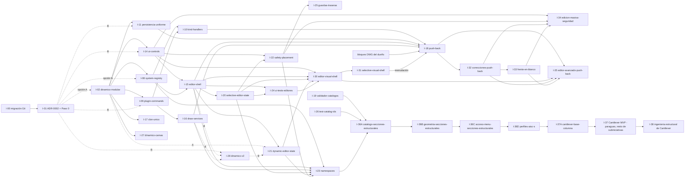

# ROADMAP — plan de ejecución por fases e iniciativas

> Actualizado: 2026-07-28 (**I-36D integrada en `main`**: **perfiles AISC S/IPS y geometría visual
> derivada**, la cuarta iniciativa de la Fase 6 y la que I-36B dejó escrita como **requisito futuro
> obligatorio**. Incorpora las **28 filas** `Type = S` que I-36A excluyó —contadas y declaradas, nunca
> perdidas— como **familia propia** con token `S` e id `AISC-S-S10X25_4`, `SSectionDimensions` como
> **tipo propio**, `structural-sections-s.csv` generado y catálogo total **1 011**; los cuatro CSV
> anteriores quedan **byte-idénticos** y `secciones.csv` intacto. Lo que la obliga está **medido contra
> el libro**: la AISC Shapes Database v16.0 **no publica la pendiente del patín ni ningún radio
> explícito**, y una S sin pendiente se lee como una **W** —pierde la familia, no el detalle, a
> diferencia del caso ya aceptado de los canales C—. Por eso separa la **autoridad tabulada** (AISC:
> identidad, dimensiones, `A`, peso, propiedades y centroide) de la **autoridad visual derivada**
> (RackCad: pendiente `1:6`, `tf` como espesor medio del vuelo libre, radio visual del filete y punta
> aguda), en un eje **ortogonal** a `SectionFidelity`, que no cambia. La regla **degenera exactamente**
> en la de ADR-0022 cuando la pendiente es cero, así que no bifurca el modelo geométrico, y el residuo
> de área (+0,25 % a +2,59 %) queda **diagnóstico**, jamás corregido. La **advertencia** —visual
> derivada, aproximada, no garantizada por fabricante, **no apta para CNC ni fabricación**— vive en el
> tipo, que se niega a construir una geometría sin ella. El Owner **aprobó la validación manual en
> AutoCAD 2025 sin observaciones** y **ADR-0023 pasó a `aceptado`**. **No toca** W, HSS, C, L,
> `secciones.csv`, `blocks.csv`, `blocks-library.dwg`, `deploy/` ni `.github/`. Siguiente habilitada:
> **I-37 — Cantilever MVP**, que **no** se abrió en esta sesión.)
>
> Anterior: 2026-07-28 (**registro autorizado de I-36D**. **No era una integración**: la fila nació
> `en curso` desde la rama `feature/perfiles-aisc-s`, con autorización expresa del Owner igual que al
> abrir I-36A; sin ella WORKFLOW §8 lo prohibiría. **I-37 pasó a depender de I-36D.**)
>
> Anterior: 2026-07-28 (**I-36C integrada en `main`**: **acceso desde el menú principal al generador
> de perfiles estructurales**. Es un **fix de descubribilidad, no de funcionalidad**: el catálogo (I-36A)
> y el generador paramétrico (I-36B) **ya estaban implementados**, pero la única forma de invocarlos era
> escribir `RACKSECCION`, y el menú `RACKCAD` —por donde entra un usuario— no los mencionaba. Añade **un
> botón**, «Generar perfil estructural», entre «Diseñar larguero» y «Abrir de la biblioteca de diseños»;
> una **acción tipada** `MainMenuAction.GenerateStructuralSection` que el Plugin lee **después** de
> cerrar el modal —el flujo pide un punto y el editor debe estar libre—; y una **autoridad compartida**
> `StructuralSectionCommandFlow` que consumen igual el botón y `RACKSECCION`. **No crea un segundo
> generador**, y 25 guardas de fuente lo comprueban. La acción **no** es un `RackInsertionRequest`: una
> sección no es un rack. El Owner aprobó los siete puntos de la validación en AutoCAD **sin
> observaciones**. **No toca geometría, catálogos ni sistemas vigentes.** Los trece pendientes de
> perfiles estructurales —IPS/S, geometría visual mejorada, I-37, miembros, cálculo, sólidos 3D,
> round-trip, familias adicionales— siguen registrados **sin rama abierta**. Siguiente habilitada:
> **I-37 — Cantilever MVP**. *(Superado por el registro de I-36D: los pendientes 1-6 —IPS/S y geometría
> visual— dejaron de estar sin rama, e I-37 pasa a depender de I-36D.)*)
>
> Anterior: 2026-07-28 (**I-36B integrada en `main`**: **geometría y representación prismática de
> secciones estructurales**, la segunda iniciativa de la Fase 6. Convierte las **983** secciones de
> I-36A en geometría **generada en código** —nada de un bloque por designación—, con fidelidad
> declarada, instancia prismática donde vive la longitud, cuatro vistas más una personalizada, **un
> único plan neutral** que consumen igual el preview y AutoCAD, inspector mínimo y el comando
> **`RACKSECCION`**, que inserta **bloques internos** del dibujo. Medido: 289 `TabulatedComplete`, 694
> `TabulatedDerived`, **cero** degradadas. El Owner aprobó el gate `owner-validation` con smoke
> focalizado y checklist completo en AutoCAD, y **ADR-0022 pasó a `aceptado`**. Aceptó también, sin
> bloquear, que los canales C **no reproducen la apariencia** de un perfil comercial —les falta la
> conicidad de patines, los redondeos de punta y las transiciones del laminado—: quedan
> `TabulatedDerived` y **no se inventa** esa geometría aquí. **No toca ningún sistema vigente**:
> `assets/catalogs`, `blocks.csv`, `blocks-library.dwg`, Domain, `deploy/` y `.github/` sin una línea, y
> en UI y Plugin todo lo aportado son archivos nuevos. Queda registrado un **requisito futuro
> obligatorio**: perfiles **IPS/S** y **geometría visual mejorada** de perfiles laminados, en iniciativa
> separada y aún sin abrir. Siguiente habilitada: **I-37 — Cantilever MVP**. *(Esa iniciativa separada
> es **I-36D**, registrada y reclamada el 2026-07-28; I-37 pasa a depender de ella.)*)
>
> Anterior: 2026-07-28 (**I-36A integrada en `main`**: núcleo y catálogo neutral de secciones
> estructurales, la primera iniciativa de la Fase 6. Importa **983** secciones de la AISC Shapes
> Database v16.0 con un importador reproducible fuera del producto y un lector CSV estricto propio.
> **ADR-0021 pasó a `aceptado`**; ADR-0020 ya lo estaba.)
>
> Anterior: 2026-07-27 (**registro autorizado de la Fase 6 — Secciones estructurales y nuevos
> sistemas**, con **I-36A**, **I-36B**, **I-37** e **I-38**. **No es una integración**: las cuatro
> filas nacen en estado `pendiente` y ninguna se ha integrado. Se registran desde la rama
> `architecture/catalogo-secciones-estructurales` porque el dueño lo **autorizó expresamente** al
> abrir I-36A y exigió que lo hiciera su primer commit sustantivo —sin el registro, el plan no
> existía— (decisión versionada en [`docs/automation/decisions/I-36A.md`](automation/decisions/I-36A.md)).
> La regla general no cambia: la **columna Estado** y `docs/HANDOFF.md` se tocan **solo** en la sesión
> de integración, como último commit de la rama (WORKFLOW §4.5.4 y §8), y esta rama no lo ha hecho.
> La fase separa la **sección transversal** del **miembro** y de la **pieza comercial**
> ([ADR-0020](adr/0020-catalogo-neutral-de-secciones-estructurales.md), que **reemplaza a ADR-0008**
> solo en autoridad conceptual, y [ADR-0021](adr/0021-identidad-unidades-y-presentacion-de-secciones.md),
> que **no** reemplaza a ADR-0005).)
>
> Anterior: 2026-07-27 (**I-23 integrada en `main`**: **namespaces finales por sistema** (E8).
> **CIERRA LA FASE 5.** Refactor **mecánico** bajo congelación funcional total: **176 archivos movidos
> con `git mv`**, todos como renombre, sin una sola línea de lógica. Los **cuatro** proyectos de producto
> —Domain, Application, **UI** y Plugin— quedan repartidos en `Systems.{Selective, Dynamic, PushBack,
> FlowBed, Larguero, Shared}` y las tres raíces planas quedan **vacías**; se disuelven **cinco**
> namespaces, incluidos `Application.Headers` y `Plugin.Headers`. La cabecera **física** conserva
> `RackFrames`; lo que **materializa** pasa a `Drawing`, simétrico en Application y Plugin. Único renombre
> autorizado: **`DynamicSystemPlan` a `Drawing.HeaderRunPlan`** — **no** se aplicó el `SystemPlan` que
> anotaba este plan, por ambiguo en el árbol actual. Los **diálogos compartidos de seguridad** y la
> infraestructura transversal de UI **no** se reparten: un diálogo compartido no se asigna a un sistema por
> número de consumidores. Los **dos proyectos de prueba** conservan un namespace de ensamblado como
> **excepción explícita y comprobable** (42 % de sus archivos cruzan sistemas). Nacen dos guardas —
> `NamespaceFolderGuardTests` y `UiSystemBoundaryGuardTests`, que **construyen** las ventanas WPF migradas—
> más `.editorconfig`, verificadas **en rojo** bajo infracción inyectada. Equivalencia demostrada: 7
> goldens byte-idénticos, superficie de API idéntica, 28 comandos byte-idénticos. Gate del Owner
> **aprobado** (smoke en AutoCAD 2025) sobre el candidato `5d49a6c`. Rama y worktree eliminados.
> **Siguiente: I-25**, en backlog diferido.)
>
> Anterior: 2026-07-27 (**I-35 integrada en `main`**: **editor avanzado de módulos de Push Back**
> (PB-011). Push Back gana la edición **longitudinal de Cabeceras y Separadores** por módulo de RACK con
> **selección única**, la **configuración transaccional** de cabecera (confirmar / cancelar sobre una
> **copia**, sin tocar el configurador compartido), la **altura manual de cabecera**, el **refuerzo total o
> parcial del poste derivado**, la **cantidad y separación globales de separadores**, y la **restauración
> individual y global**. Los cuatro parámetros avanzados son **globales del rack** y reutilizan las
> autoridades que la estructura dinámica compuesta ya poseía: **no se creó ninguna autoridad nueva**. La
> reconciliación empareja por **`ModuleId + Kind`** exacto y **nada se pierde en silencio**: un módulo
> eliminado o con el tipo cambiado se **reporta**. Preserva **I-33** y **PB-013**. La primera ronda del
> Owner quedó **parcialmente rechazada** por cuatro residuos, corregidos en la segunda; gate del Owner
> **aprobado** sobre el candidato `f2be30c`. Rama y worktree eliminados. **Siguiente: I-25 e I-23.**)
>
> Anterior: 2026-07-27 (**I-34 integrada en `main`**: **edición masiva de matrices de seguridad**
> (PB-007). Las **cuatro** matrices booleanas —desviador (eje **Poste**), tope (eje **Frente**, que cubre a
> la vez el tope del Selectivo y el **tope posterior de Push Back**), guía y **parrilla**— ganan el estado
> **Activar/Desactivar** y los alcances **Celda / Nivel / Frente-o-Poste / Todo**, sobre una fundación pura
> y **agnóstica a `RackSystemKind`**: cada diálogo **declara** sus etiquetas y capacidades. La **parrilla**
> entró por **addendum normativo del Owner** conservando su **contador vivo por celda**, resuelto como un
> **adorno opt-in y neutral** del control compartido. Gate del Owner **aprobado** sobre el candidato
> `dbdda74`. La **defensa** no entró y **no bloqueó**: es candidato futuro independiente. Rama y worktree
> eliminados. **Siguiente: I-25 e I-23** (I-35 está en curso, esperando decisión del Owner).)
>
> Anterior: 2026-07-27 (**I-33 integrada en `main`**: **frente en blanco** para Dinámico y Push Back
> (PB-014). Un frente pasa a tener estado **Activo / En blanco**; en blanco conserva claro y estructura,
> desplaza a los posteriores y no lleva carga, con su configuración dormida. Autoridad única
> `DynamicFrontActivation`. Incluye —decisión del Owner— la **frontera compartida por dos frentes en blanco
> que no existe**. Gate del Owner **aprobado**, incluida la ronda focalizada de fronteras físicas, sobre el
> candidato `b840cfe`. Rama y worktree eliminados. **Siguiente: I-25 e I-23.**)
>
> Anterior: 2026-07-27 (**I-32 integrada en `main`** (merge `--no-ff` `236619d`, CI 30228331452 4/4):
> correcciones funcionales y geométricas de Push Back sobre el reporte del Owner, con la **geometría
> asimétrica de la cama** como regla final. Gate del Owner **aprobado**: CODE_SHA `f911d75`, build
> validado `a0c3f27`, DLL SHA-256 `B7B15802…`. Rama y worktree eliminados.)
>
> Anterior: 2026-07-24 (**I-31 integrada en `main`** (merge `--no-ff` `ad0ea1f`): **migración del
> editor Selectivo** (`RackSelectiveWindow`) **al shell visual común** (`RackEditorVisualShell`, I-30) por
> composición y slots + `EditorShellWindowStyle`, **solo XAML** (el `.cs` es byte-idéntico a `origin/main`),
> **sin cambio** de dibujo/BOM/GUID/persistencia/handlers/comportamiento; conserva los 45 `x:Name`, la
> selección de una sola celda + alcance (sin multiselección, como en `main`), el selector y matrices por
> fondo, previews frontal/lateral, inserción/actualización, BOM, biblioteca y round-trip; +19
> `SelectiveShellMigrationTests`. Owner **validó en AutoCAD 2025 los 12 puntos** sin observaciones
> (`autocad` y `owner_validation` aprobadas; SHA `b638653`, `1.0.0+b638653…`). `feature/push-back`
> **intacta** (`b2d9e9d`). **Siguiente obligatorio: reanudación de I-18** (rebasar `feature/push-back`
> sobre el nuevo `origin/main`). Antes ese día — **I-30 integrada en `main`**: **fundación del shell visual común de editores**
> —`RackEditorVisualShell` como control lookless con plantilla, composición por slots, status presenter por
> severidades, action bar de categorías neutrales y tokens de tamaño/color/tipografía/espaciado en
> `AppStyles.xaml`— **más la migración real de `RackDynamicSystemWindow`** al shell, que consume el contrato
> de tamaño común (`EditorShellWindowStyle`, `ShellMinHeight` 672) y la paleta de estado por tokens, **sin
> cambio** de dibujo/BOM/GUID/persistencia/handlers (los 63 `x:Name`, parsing, `LostFocus`, selección,
> recomputación, preview e inserción se conservan). Shell **agnóstico a `RackSystemKind`**. El Owner
> **validó en AutoCAD 2025 los 12 puntos** (`autocad` y `owner_validation` aprobadas). NO tocó Selectivo ni
> Push Back (`feature/push-back` solo lectura, intacta). **Handoff obligatorio: I-31 → reanudación de I-18.**
> Antes ese día — **fix documental autorizado por el dueño**: se registraron en Fase 5 las
> iniciativas **I-30 — fundación del shell visual común de editores** (`architecture/editor-visual-shell`)
> e **I-31 — migración del editor Selectivo al shell visual** (`refactor/selective-visual-shell`), con la
> **secuencia obligatoria I-30 → I-31 → reanudación de I-18**; solo documentación,
> sin cambio de producto ni de estados existentes. Resolvió el gate documental reportado el 2026-07-23.
> Antes, el 2026-07-22: **I-07 integrada en `main`**: retro-documentación de las 13 decisiones de
> HANDOFF §7 como **ADR-0006–0018** (aceptados por el dueño el 2026-07-22, «Sí, apruebo»); **solo
> documentación, sin cambio de producto**; HANDOFF §7 pasa a puntero a `docs/adr/`. Antes ese día:
> **I-03 integrada en `main`**: **fallos silenciosos** (P1/D2) —logger mínimo a
> `%AppData%\RackCad\logs`, `Report()` con stack, los 14 `catch` del Plugin y los stores best-effort registran,
> escritura atómica en los 4 stores y carga que distingue archivo ausente de ilegible; **aditivo, sin cambio de
> comportamiento**, preserva I-11—. Antes ese día: **I-22 integrada en `main`**: **colocación de seguridad del selectivo** (E6/E7)
> —servicios/planes puros de colocación por familia (tope con su resultado frontal propio `BuildFrontal`, tarima,
> separador, parrilla unificada) con los builders y el BOM como orquestadores; configuraciones y **DTO por subtipo**
> (`SafetySelectionDocuments`, wire format plano byte-idéntico); **paso de troquel en UNA constante**; las rejillas
> tope/desviador/guía adoptan `SelectionMatrix` (con celda ausente)—, **sin cambio de comportamiento** (7 golden
> idénticos; **AutoCAD + owner-validation aprobadas**); **desbloquea I-25**. Antes ese día: **I-24 integrada en
> `main`**: **pruebas de editores** en `tests/RackCad.UI.Tests`
> —ViewModels y límites reales de las ventanas por handlers WPF reales, firma completa del dibujo dinámico/
> selectivo incluidas anotaciones y cotas—; **29 nuevas** (139→168 UI) más un **único seam interno** de prueba,
> **sin cambio de comportamiento** (U3, cierra la pista de UI). Antes ese día: **I-05 integrada en `main`**:
> guardia de unidades visible y **NO bloqueante** que
> lee `INSUNITS` al insertar y en `RACKLAYOUT`/`RACKRELLENAR` y avisa si el dibujo no está en pulgadas —sin
> conversión ni reescalado—; **ADR-0005 aceptado** (D4). Antes, el 2026-07-21: **I-20 integrada en `main`**:
> extracción del **estado del editor selectivo** a
> `RackCad.Application` —`SelectiveEditorState` + `SelectiveEditorCell`/`SelectiveEditorFondoMatrix`/
> `SelectiveApplyScope`/`SelectiveDesignInputs`—; `RackSelectiveWindow` observa el estado y pinta; sin cambio de
> dibujo/BOM/GUID/persistencia/UI (hallazgos U1/U3); **desbloquea I-22** (orden fijo, I-20 primero). Antes ese
> mismo día: **I-21 integrada en `main`**: **Estado del editor Dinámico** —extrae de `RackDynamicSystemWindow` a
> `RackCad.Application` la matriz frente×nivel con su selección (`DynamicFrontMatrix`), las celdas/frentes/buffer,
> la seguridad (`DynamicEditorSafety`) y la recomputación/construcción del diseño (`DynamicEditorDesignAssembler`);
> la ventana queda coordinando sobre el Editor Shell, sin cambio de dibujo/BOM/GUID/persistencia/UI. Antes ese
> día: I-15 integrada en `main`: **Editor Shell** —`RackEditorSession`,
> `RackEditorIdentity`, `RecomputeGate`/`RecomputeDebouncer`, `RackInsertionRequest` e
> `IRackEditorModule`+`EditorModuleRegistry`— **adoptado por las cuatro ventanas ricas** (catálogo, identidad,
> recompute coalescido e inserción); el menú y la biblioteca consumen el registro (mata el O(N) de
> `RackMainMenuWindow`); el estado interno de selectivo/dinámico queda para I-20/I-21; sin cambio de
> dibujo/BOM/GUID/persistencia/UI. Ese mismo día también se integraron I-12 —versionado real en
> `Directory.Build.props`— e I-19 —validador de catálogos—. Antes: I-14 integrada en `main`: controles comunes de UI —`SelectionMatrix`,
> `NumericField`, `CatalogCombo`, `PreviewCanvas` con proyección/paleta compartidas y base `RackDialogWindow`,
> con lógica pura separada de la vista— más el proyecto `tests/RackCad.UI.Tests` (net8.0-windows) y su gate de
> CI `ui-tests`; **abre la pista C de UI** y desbloquea I-15 de la dependencia I-14, sin migrar ventanas ni tocar
> geometría/BOM/persistencia/AutoCAD). Antes ese día: I-11 integrada en `main`: persistencia uniforme
> —`FlowBedDocument`/`LargueroDocument` versionados y preservación de campos JSON desconocidos + versión no
> degradada en los cuatro límites; **cierra la pista A de Application** I-08→I-11 y desbloquea I-18 de esa
> dependencia. Antes: I-10 integrada (`IRackKindHandler` + `KindHandlerRegistry` en el **Plugin**;
> RACKEDITAR/RACKBOMTOTAL y el restamp despachan por el registro y un `Kind` sin handler produce un error
> visible; cierra la pista B I-09→I-16→I-10); I-08 integrada (`SystemRegistry` + descriptor en Application,
> `RackProjectStore`/validación/biblioteca despachan por el registro y `RackDesignKind` eliminado) e I-16
> integrada (refactor de Draw Services), ambas sin cambio de comportamiento. Antes: I-09 integrada el
> 2026-07-20 (partición de `RackFrameCommands`); I-13 e I-29 integradas antes ese día.
> Convierte la
> [auditoría 2026-07](auditoria-arquitectura-2026-07.md) en un plan ejecutable por iniciativas
> independientes (1 iniciativa = 1 rama = 1 worktree, ver [WORKFLOW.md](WORKFLOW.md)).
> Jerarquía de "qué sigue": **este documento = el plan**; HANDOFF §11 = lo inmediato;
> ideas-futuras.md = backlog largo y deuda diferida.
>
> Cómo se usa: el estado "en curso" NO se anota aquí — se deriva de la existencia de la rama en
> origin (`git fetch && git branch -r`). Este archivo se edita SOLO en la sesión de integración
> (último commit de la rama, WORKFLOW §4.5.4): la columna Estado pasa de `pendiente` a
> `integrada (fecha)` o `descartada (fecha, motivo)`. Sin hashes aquí (viven en HANDOFF §12).
> Al cerrar una fase completa, sus filas integradas se mueven a la sección "Cerradas" del final.

## Principios del plan

1. **El trunk siempre funciona.** Ninguna fase deja el plugin a medias; cada iniciativa se integra
   completa o no se integra.
2. **Nada de big-bang.** Los refactors grandes de la auditoría se partieron en iniciativas de 1-3
   sesiones; si una crece más, se parte otra vez.
3. **Strangler, no reescritura**: lo nuevo se construye junto a lo viejo, los consumidores migran
   uno a uno, y lo viejo se borra al final.
4. **La validación humana es el cuello de botella y se administra**: máximo 1-2 iniciativas
   esperando validación en AutoCAD a la vez; si la cola crece, las pistas pausan integraciones (no
   producción). Los refactors "que preservan comportamiento" (I-09, I-16, I-23) reducen esa carga
   con **tests golden de equivalencia de planes** (snapshot del plan de bloques antes vs después,
   patrón que ya existe en los tests "ARRAY == plano"): la validación humana queda en muestreo.
5. **Push Back es la prueba de fuego** de la arquitectura nueva: si su alta exige editar código de
   otros sistemas, la Fase 2-3 quedó incompleta (consumir contratos compartidos SÍ está permitido).
6. Las decisiones que condicionan fases van a [ADR](adr/README.md) ANTES de implementarse.
7. **"Independiente" = sin dependencias previas; los estorbos declarados siguen aplicando.** Una
   iniciativa de relleno solo arranca si sus estorbos no están en curso (WORKFLOW §2).

## Fases

| Fase | Nombre | Objetivo | Criterio de salida |
|---|---|---|---|
| 0 | Preparación del proyecto — **CERRADA (2026-07-17)** | Proceso sano: trunk real, CI, flujo nuevo, decisión del dinámico | CUMPLIDO: main = trunk protegido; ADR-0002 aceptado (opción A, tras su Paso 0); cero ramas zombie |
| 1 | Robustez y limpieza | Cerrar riesgos latentes baratos + resolver la rama del dinámico | I-02 resuelta; fallos diagnosticables; docs reestructurados; I-13 concluido |
| 2 | Arquitectura base + producto dinámico | Contratos/registros que abaratan el sistema N+1 (la brecha cama↔dinámico quedó cerrada por I-02) | Alta de un Kind sin tocar stores/switches; persistencia uniforme (I-27 quedó absorbida por I-02) |
| 3 | Componentes reutilizables | UI y Plugin componibles (controles, shell, draw service genérico) | Un editor nuevo cuesta ~300 líneas; rejilla de seguridad única |
| 4 | Primer sistema nuevo | Push Back sobre la arquitectura nueva + guía validada | Push Back completo sin editar código de otros sistemas |
| 5 | Migración progresiva — **CERRADA (2026-07-27)** | Los sistemas existentes adoptan la arquitectura, uno a uno | CUMPLIDO: editores migrados al shell (I-30/I-31); **namespaces finales por sistema en los cuatro proyectos (I-23)**; lista de archivos calientes reducida. Queda I-25 en backlog diferido |
| 6 | Secciones estructurales y nuevos sistemas | Una autoridad neutral de **sección transversal** (independiente del rol de miembro) sobre la que nazcan los sistemas de perfil estándar, empezando por Cantilever | Catálogo neutral completo y verificable (I-36A) → geometría prismática derivada (I-36B) → acceso desde el menú (I-36C) → perfiles S/IPS y geometría visual derivada (I-36D) → Cantilever dibujando y con BOM (I-37) → su ingeniería estructural (I-38) |

Las fases se traslapan donde las dependencias lo permiten: la pista de UI (I-14→I-15) puede correr
en paralelo con la Fase 2 de Application porque tocan capas distintas.

## Iniciativas

Tamaño: S = 1 sesión, M = 2-3 sesiones, L = partir antes de ejecutar. "Se estorba con" = no correr
en paralelo con esa iniciativa (mismos archivos). ✋ = requiere validación del dueño en AutoCAD al
cerrar (cuenta contra la cola del principio 4).

### Fase 0 — Preparación — CERRADA (2026-07-17)

Sus dos iniciativas quedaron integradas y sus filas viven en la sección "Cerradas" del final.
Resultado: `main` trunk protegido, flujo por iniciativas operando, **ADR-0002 aceptado con la
opción A** (evidencia en `adr/0002-paso0-evidencia.md`), cero ramas zombie.

### Fase 1 — Robustez y limpieza

| ID | Iniciativa (rama) | Qué incluye (hallazgos) | Tamaño | Depende de | Se estorba con | Estado |
|---|---|---|---|---|---|---|
| I-02 | `feature/dinamico-modular` ✋ | **ADR-0002=A ejecutada**: tag de resguardo sobre la punta validada, rama renombrada (ADR-0001), rebase sobre el trunk conservando los arreglos de main (los conflictos fueron solo los 7 docs previstos), catálogos append-only intactos, suite + builds + CI + **re-validación AutoCAD sobre el árbol rebasado** completas (HANDOFF §8-12). Estabilizada en 1 de las 3 sesiones permitidas; la contingencia (opción B) no se activó. Absorbe I-27 | M-L | I-01=A (cumplida) | I-08, I-09, I-11, I-14, I-16, I-17 (quedaron desbloqueadas al integrarse) | integrada (2026-07-17) |
| I-03 | `refactor/fallos-silenciosos` | Logger mínimo a `%AppData%\RackCad\logs`; los 14 catch del Plugin + los de Persistence registran; `Report()` con stack; aviso de catálogo vacío; escritura atómica temp+`File.Replace` en los 4 stores; carga distingue "no existe" de "ilegible" (P1, D2) | M | — | I-11 | integrada (2026-07-22) |
| I-04 | `fix/install-bundle-preserva-datos` | Instalación transaccional con validación previa, staging, respaldo y rollback; reemplaza catálogos CSV/JSON de producto sin fusionarlos, preserva `blocks-library.dwg` byte por byte y regenera un bundle limpio/reproducible (G7) | S | — | — | integrada (2026-07-17) |
| I-05 | `feature/guardrail-unidades` ✋ | Leer `INSUNITS` al insertar/RACKLAYOUT/RACKRELLENAR y avisar si ≠ pulgadas; ADR de estrategia de unidades a largo plazo (D4) | S | — | — | integrada (2026-07-22) |
| I-06 | `docs/reestructura` | Entregó `ARCHITECTURE.md`, nueve Context Packs, glosario y guías vigentes, archivo histórico, HANDOFF reducido y automatización documentada pero pausada; preservó el contenido único y corrigió rutas y navegación. I-07 se desbloquea solo tras el merge efectivo | M | — | I-07 | integrada (2026-07-17) |
| I-07 | `docs/adr-retroactivos` | Retro-documentar las ~13 decisiones de HANDOFF §7 como ADRs de una página (C4) | S | — | I-06 | integrada (2026-07-22) |
| I-13 | `architecture/referencias-autocad-ci` | Promovió la evidencia conservada en `archive/i-13-experiment-final-4e084d2` a un build limpio del Plugin sin AutoCAD en CI: referencias condicionales compile-only, versiones/hashes/origen fijados, guardas fail-closed, bundle y artifacts sin material Autodesk. ADR-0003 acepta la excepción cero-NuGet limitada conforme a I-29 | S | — | — | integrada (2026-07-20) |
| I-26 | `refactor/test-catalog-ids` | `TestCatalogIds` centralizados; guardián de IDs y relaciones esenciales contra los catálogos distribuidos; cobertura Cobertura publicada como artifact de CI | S | — | — | integrada (2026-07-19) |
| I-29 | `docs/licencia-procedencia-autocad-ci` | Decisión B: aprobada con restricciones para uso interno de RackCad como aceptación interna de riesgo; no es conclusión jurídica ni autorización expresa de Autodesk. Sus catorce restricciones y revisión obligatoria quedaron aplicadas en ADR-0003 | S | — (usa evidencia técnica de I-13) | — | integrada por I-13 (2026-07-20) |

### Fase 2 — Arquitectura base + producto dinámico

| ID | Iniciativa (rama) | Qué incluye (hallazgos) | Tamaño | Depende de | Se estorba con | Estado |
|---|---|---|---|---|---|---|
| I-08 | `architecture/system-registry` | Descriptor de sistema + `SystemRegistry` en Application; `RackProjectStore`/validación/`RackDesignLibrary` consumen el registro (mueren los 3 switches y el enum paralelo) (E1) | M | I-02 (integrada 2026-07-17) | I-10, I-11 | integrada (2026-07-21) |
| I-09 | `refactor/plugin-commands` | Partir `RackFrameCommands` en clases por área; promover helpers a `RackBlockFinder`/`RackCloner`/`LayerHelper`; unificar el escaneo de envelopes triplicado; helpers `InDocumentTransaction`. Sin cambio de comportamiento: diff mecánico revisable (P2, P5) | M | I-02 (integrada 2026-07-17) | I-10, I-16 | integrada (2026-07-20) |
| I-10 | `architecture/kind-handlers` | `IRackKindHandler` + registro en el **Plugin** (pista Plugin, no Application); RACKEDITAR/RACKBOMTOTAL/RACKLAYOUT/restamp despachan por registro; Kind no registrado = error visible (E2) | M | I-08, I-09 | I-09, I-16 | integrada (2026-07-21) |
| I-11 | `architecture/persistencia-uniforme` | `FlowBedDocument`/`LargueroDocument` versionados con lectura legacy; preservación de campos JSON desconocidos + versión no degradada en los 4 límites; envelope preservado desde el tipo (Xrecord físico intacto). `RackFrameProjectDocument` excluido por decisión del dueño (D1, D3) | M | I-02 (integrada 2026-07-17) | I-03, I-08 | integrada (2026-07-21) |
| I-12 | `refactor/versionado` | `<Version>` única en Directory.Build.props + SHA estampado; `PackageContents.xml` generado; bundle por `dotnet publish`; centralizar LangVersion/Nullable en Build.props; **ADR corto "estrategia de versiones de AutoCAD"** (SeriesMax, política de recompilación anual — AutoCAD 2026/2027 llegan dentro del horizonte del plan) (G5, G8, G9) | S-M | — | — | integrada (2026-07-21) |
| I-27 | `feature/dinamico-camas` ✋ | **Absorbida por la implementación dinámica de I-02**: la cama de rodamiento quedó integrada dentro del dibujo del sistema dinámico (`DynamicFlowBedLateralBuilder` compone `FlowBedLateralBuilder` sin duplicarlo; BOM con componente `Cama` sin despiece), validada en pruebas y en AutoCAD, y la línea "Fuera de alcance" del README quedó actualizada. También cumplió la prueba temprana de composición entre sistemas que I-18 necesitará. Sin alcance restante — no se mantiene como iniciativa separada | M | I-02 (la absorbió) | — | integrada por I-02 (2026-07-17) |

### Fase 3 — Componentes reutilizables

| ID | Iniciativa (rama) | Qué incluye (hallazgos) | Tamaño | Depende de | Se estorba con | Estado |
|---|---|---|---|---|---|---|
| I-14 | `architecture/ui-controls` | `SelectionMatrix` (mata las rejillas duplicadas: 3 hoy, 5-6 tras I-02), `NumericField`, `CatalogCombo`, clase base `RackDialogWindow`, `PreviewCanvas` con proyección/paleta compartida. **Incluye crear `tests/RackCad.UI.Tests` (net8.0-windows) + su job de CI: los controles nacen con tests** (U5-U7, parte de U3) | M | I-02 (integrada 2026-07-17) | I-15, I-17 | integrada (2026-07-21) |
| I-15 | `architecture/editor-shell` | `RackEditorSession` (catálogo, identidad, Recompute coalescido, contrato de inserción) + `IRackEditorModule` + registro de módulos que el menú y la biblioteca consumen (mata las 13 propiedades O(N)) (E3, E5, U1 parcial) | M | I-08, I-14 | I-14 | integrada (2026-07-21) |
| I-16 | `refactor/draw-services` | `ViewBlockDrawService` genérico (colapsa los DrawServices idénticos: 5 hoy, 7 tras I-02); extraer `BlockPlacementService` + catálogo de `LateralHeaderDrawService`; uniformar `regen`. **Con tests golden de equivalencia de planes** (E4, P3) | M | I-09 | I-09, I-10 | integrada (2026-07-21) |
| I-17 | `refactor/clon-unico-cabecera` | Un solo deep-clone de `RackFrameConfiguration` vía store de serialización; borrar las 3 copias de la UI (VM del configurador, selectivo, dinámico) + test de equivalencia (U4). **No es relleno: toca 2 archivos calientes y un archivo que I-02 reescribe** | S | I-02 (integrada 2026-07-17) | I-14; no en paralelo con trabajo en selectivo/configurador | integrada (2026-07-22) |

### Fase 4 — Primer sistema nuevo

| ID | Iniciativa (rama) | Qué incluye | Tamaño | Depende de | Se estorba con | Estado |
|---|---|---|---|---|---|---|
| I-18 | `feature/push-back` ✋ | Push Back como PRIMER módulo del patrón nuevo: descriptor + documento versionado + resolver/builders → SystemPlan + BOM + editor sobre el shell + draw adapter genérico, **componiendo lo compartido que ya existe** (la cama `FlowBedType.Pushback` del código actual). Al cerrar: `guias/agregar-un-sistema.md` validada por la experiencia real. **Prerequisito humano calendarizado: el dueño dibuja los bloques DWG de Push Back y define sus filas de catálogo ANTES de arrancar** (referencia de costo: una sola familia de desviadores exigió 21 bloques y una sesión de validación) | L (partir al diseñarla) | I-10, I-11, I-15, I-16 + bloques DWG del dueño | — | **integrada (2026-07-25)** — I-18a/b/c completas; gate manual del Owner **aprobado** (PB-VAL-01…06). El **preview visual** queda **diferido** a una iniciativa transversal futura y **no** fue aprobado visualmente |
| I-19 | `feature/validador-catalogos` | Validador con severidades (ids duplicados, FKs, bloques/vistas faltantes, filas descartadas por rol con aviso) + manifest de blocks-library.dwg (ideas-futuras #14/#15). Conviene cerca de I-18 (mete filas nuevas al catálogo) | M | — | — | integrada (2026-07-21) |
| I-28 | `feature/dinamico-v2` ✋ | **Solo si un ADR futuro reemplaza a ADR-0002 por la opción B** (contingencia de I-02; ADR-0002 quedó aceptado con A el 2026-07-17): re-implementar el dinámico modular sobre el registro y el shell, usando la rama archivada como referencia de requisitos; absorbe el alcance de I-27 | L | ADR nuevo que reemplace ADR-0002, I-15, I-16 | I-21 | condicional |

### Fase 5 — Migración progresiva (serializar las del mismo subsistema)

| ID | Iniciativa (rama) | Qué incluye | Tamaño | Depende de | Se estorba con | Estado |
|---|---|---|---|---|---|---|
| I-20 | `refactor/selective-editor-state` | Extraer `FondoMatrix`/`Cell`/`ApplyScope`/`BuildDesign` a Application (testeables); la ventana queda observando/pintando (U1, U3) | M | I-15 | I-22 (orden fijo: I-20 primero) | integrada (2026-07-21) |
| I-21 | `refactor/dynamic-editor-state` | Ídem para el editor dinámico (~3,318 líneas si A; 1,332 si B). Partir por vistas si excede | M-L | I-15 + I-02 (A ejecutada e integrada; I-28 solo si un ADR futuro reemplaza ADR-0002) | I-28 | integrada (2026-07-21) |
| I-22 | `refactor/safety-placement` | Servicios de colocación por familia (Tope/Parrilla/Tarima…) parametrizados por vista; subtipos de `SelectiveSafetySelection` con DTO por subtipo; paso de troquel en UNA constante; las rejillas adoptan `SelectionMatrix` (E6, E7) | M | I-14, I-20 (orden fijo) | I-20 | integrada (2026-07-22) |
| I-23 | `refactor/namespaces-sistemas` ✋ | **Namespaces finales por sistema** (E8) — **CIERRA LA FASE 5**. Refactor **mecánico** bajo congelación funcional total: **176 archivos** con `git mv`, todos como renombre, sin una línea de lógica. Reparte los **cuatro** proyectos de producto (Domain, Application, **UI** y Plugin) en `Systems.{Selective, Dynamic, PushBack, FlowBed, Larguero, Shared}`; las tres raíces planas quedan vacías y se disuelven **cinco** namespaces, incluidos `Application.Headers` y **`Plugin.Headers`**. `RackFrames` conserva la cabecera **física** (Domain, Application y UI); lo que **materializa** pasa a `Drawing`, simétrico en Application y Plugin. Único renombre autorizado: **`DynamicSystemPlan` a `Drawing.HeaderRunPlan`** — **no** se aplicó el `SystemPlan` que anotaba este plan, ambiguo en el árbol actual porque colisiona con `SystemBomBuilder`/`SystemDescriptor`/`SystemRegistry`/`SystemBlockWriter`. Regla objetiva: un archivo pertenece al sistema que su tipo de primer nivel **nombra y modela**; **consumir** un contrato ajeno no lo mueve. Por eso los **diálogos compartidos de seguridad** y la infraestructura transversal de UI (`Controls`, `Editor`, `Preview`, `Shell`, `Themes`) **no** se reparten: un diálogo compartido no se asigna a un sistema por número de consumidores. Los **dos proyectos de prueba** conservan un namespace de ensamblado como **excepción explícita y comprobable** (92 de 220 archivos, 42 %, cruzan sistemas). Añade `.editorconfig` y **dos guardas** —`NamespaceFolderGuardTests` (7) y `UiSystemBoundaryGuardTests` (3, que **construyen** las seis ventanas WPF migradas y validan `x:Class` y pack URIs)—, verificadas **en rojo** bajo infracción inyectada. `EnforceCodeStyleInBuild` **no** se activa (el proyecto WPF temporal produce 68 falsos IDE0130). Sin cambio de dibujo, BOM, GUID, persistencia, wire format, catálogos, DWG, comandos, alias ni textos | M | I-08, I-15, I-16, I-20, I-21, I-22 | toda la Fase 5 | **integrada (2026-07-27)** — smoke del Owner en AutoCAD 2025 **APROBADO** sobre el candidato `5d49a6c`; 7 goldens byte-idénticos, superficie de API idéntica y 28 comandos byte-idénticos |
| I-24 | `refactor/ui-tests-editores` | Tests de ViewModels y estados de editor sobre `tests/RackCad.UI.Tests` (el proyecto nace en I-14) (U3) | S | I-15, I-20 | — | integrada (2026-07-22) |
| I-25 | `feature/guardas-traseras` ✋ | Última familia de seguridad (prioridad final del producto), construida sobre I-22 | M | I-22 | — | **backlog diferido** — ni completada ni descartada. Al cerrarse la Fase 5 deja de estar bloqueada por el estorbo de I-23 |
| I-30 | `architecture/editor-visual-shell` ✋ | **Fundación del shell visual común de editores** (tipo: arquitectura): contrato visual y tokens, componentes del shell, status presenter, action bar común, pruebas y **migración real de `RackDynamicSystemWindow`**. NO incluye Selectivo ni modificación de Push Back (`feature/push-back` solo en lectura). Requiere CI, builds Debug, AutoCAD y owner-validation. **Secuencia obligatoria: integrar I-30 antes de I-31 y antes de reanudar I-18** | — | I-14, I-15, I-20, I-21, I-24 (integradas) | I-31 (orden fijo: I-30 primero); reanudación de I-18 (espera la secuencia) | integrada (2026-07-24) |
| I-31 | `refactor/selective-visual-shell` (provisional) ✋ | **Migración del editor Selectivo al shell visual**: migrar `RackSelectiveWindow` al shell integrado por I-30, preservando estado, geometría, BOM, persistencia y handlers. **No puede reclamarse antes de cerrar I-30**; debe integrarse antes de rebasar y reanudar I-18 | — | I-30 integrada | I-30 (orden fijo); reanudación de I-18 | integrada (2026-07-24) |
| I-32 | `fix/correcciones-push-back` ✋ | **Correcciones funcionales y geométricas de Push Back** a partir del reporte del Owner sobre el sistema ya integrado por I-18: diez hallazgos (PB-002…006, 008…010, 012, 013), el override opt-in de elevaciones en sus cuatro ámbitos, el default del protector lateral y la **geometría ASIMÉTRICA de la cama**. PB-001, PB-007, PB-011 y PB-014 quedan diferidos en `ideas-futuras.md` y no bloquean | M | I-18 integrada | — | **integrada (2026-07-27)** — merge `--no-ff` `236619d`, CI 30228331452 4/4; validación manual del Owner **APROBADA** sobre el build `a0c3f27` (DLL SHA-256 `B7B15802…`, CI 30226757221) |
| I-33 | `feature/frente-en-blanco` ✋ | **Frente en blanco para Dinámico y Push Back**: implementa **PB-014**, que I-32 dejó diferido pidiendo decisión de alcance (la da el Owner al abrir la iniciativa). Un frente pasa a tener estado **Activo / En blanco**: en blanco conserva su claro y su estructura, desplaza a los frentes posteriores y no lleva ningún nivel ni componente de carga, con su configuración **dormida** para reactivarlo intacto. Autoridad única `DynamicFrontActivation` sobre la estructura dinámica que Push Back compone. Incluye el rechazo canónico del rack todo-en-blanco (sin normalizar en silencio), la edición deshabilitada al seleccionar un frente en blanco, las celdas de nivel inexistentes en los diálogos de seguridad con su configuración dormida preservada, el desacople forma-de-rejilla / selector de lado, y —decisión del Owner— la **frontera compartida por dos frentes en blanco que NO existe**. Fuera de alcance: Selectivo, PB-001, PB-007, PB-011, I-23, I-25, catálogos, DWG y shell | M | I-18, I-21, I-30, I-31, I-32 (integradas) | I-23, I-25 | **integrada (2026-07-27)** — validación manual del Owner **APROBADA**, incluida la ronda focalizada de fronteras físicas, sobre el candidato `b840cfe` |
| I-34 | `feature/edicion-masiva-seguridad` ✋ | **Edición masiva de matrices de seguridad**: implementa **PB-007**, que I-32 registró y I-33 dejó explícitamente fuera de alcance pidiendo decisión del Owner por tocar diálogos COMPARTIDOS. Hoy las rejillas de seguridad son celda a celda (solo «Todos»/«Ninguno»): quitar el desviador del segundo nivel en 100 frentes cuesta 100 clics. Añade una **fundación común pura sobre `SelectionMatrixModel`** con **celda primaria no persistida**, estado **Activar/Desactivar** y alcances **Celda / Nivel / Frente-o-Poste / Todo**, al patrón de «Aplicar a:» que ya existe en los editores (`SelectiveApplyScope`, `DynamicRackCellScope`). La infraestructura es **agnóstica a `RackSystemKind`**: cada diálogo declara sus etiquetas y capacidades. Celdas **ausentes ignoradas**, **una** notificación agregada por operación masiva y **sin rebuild por celda**. Fuera de alcance: DTO, formato de alambre, stores, geometría, BOM, catálogos, DWG, namespaces, shell visual, `DesviadorCellsAreByPost`, **parrilla** y **defensa** | M | I-14, I-22, I-32, I-33 (integradas) | I-23, I-25 | **integrada (2026-07-27)** — validación manual del Owner **APROBADA** sobre el candidato `dbdda74`; incluye la **parrilla del Selectivo**, incorporada por addendum normativo del Owner. La **defensa** no entró y **no bloqueó**: queda como candidato futuro independiente |
| I-35 | `feature/editor-avanzado-push-back` ✋ | **Editor avanzado de módulos de Push Back**: implementa **PB-011**, la prioridad alta del Owner que I-32 dejó diferida. El Dinámico permitía seleccionar un módulo —cabecera o separador— y personalizarlo; Push Back no. Entrega la **edición longitudinal de Cabeceras y Separadores** por módulo de RACK (los módulos son **una sola secuencia longitudinal**, nunca por frente ni por poste) con **selección única**; la **configuración transaccional** de cabecera —confirmar/cancelar sobre una **copia**, sin modificar `RackFrameConfiguratorWindow`—; la **altura manual de cabecera**; el **refuerzo total o parcial del poste derivado**; la **cantidad y separación globales de separadores**; y la **restauración individual y global**. Los cuatro parámetros avanzados son **globales del rack**, viven en su propia sección y reutilizan **exclusivamente** las autoridades existentes (`ManualHeaderHeightOverride`, `DerivedPostReinforced`, `DerivedPostReinforcementHeight`, `SeparatorCountOverride`, `SeparatorSpacingOverride`): **cero autoridades nuevas**. La reconciliación empareja por **`ModuleId + Kind`** exacto, **adapta** `Depth` y peralte de una cabecera conservada, y **reporta** preservados, adaptados, eliminados, incompatibles y restaurados: no existe descarte ordinario. Preserva **I-33** (frentes en blanco y fronteras suprimidas) y **PB-013**. Fuera de alcance: `SelectionMatrix*`, `Safety*GridWindow`, topes, desviadores, guías, defensas, Selectivo, catálogos, DWG y cambios funcionales en el Dinámico | M | I-15, I-17, I-18, I-21, I-30, I-32, I-33, I-34 (integradas) | I-23, I-25 | **integrada (2026-07-27)** — primera ronda del Owner **parcialmente rechazada** (cuatro residuos), corregidos; validación manual del Owner **APROBADA** sobre el candidato `f2be30c` |

### Fase 6 — Secciones estructurales y nuevos sistemas

> **Registro autorizado expresamente por el dueño al abrir I-36A** (decisión versionada en
> [`docs/automation/decisions/I-36A.md`](automation/decisions/I-36A.md)): I-36A e I-36B no tenían fila
> y el dueño ordenó que la creara el primer commit sustantivo de `architecture/catalogo-secciones-estructurales`.
> I-37 e I-38 se registran como **plan**, sin implementarse ni reclamarse.
>
> El eje de la fase es una separación que los sistemas actuales no necesitaban: la **sección
> transversal** (qué forma tiene el material) deja de ser lo mismo que el **miembro** (para qué se usa)
> y que la **pieza comercial** (qué SKU se compra). Cantilever la fuerza: la misma `W12X26` puede ser
> columna, brazo o base. La decisión vive en [ADR-0020](adr/0020-catalogo-neutral-de-secciones-estructurales.md),
> que **reemplaza a ADR-0008** solo en autoridad conceptual —`secciones.csv` sigue operando sin cambio
> como catálogo legado hasta que las migraciones futuras, una por configurador, lo retiren—.

| ID | Iniciativa (rama) | Qué incluye | Tamaño | Depende de | Se estorba con | Estado |
|---|---|---|---|---|---|---|
| I-36A | `architecture/catalogo-secciones-estructurales` | **Núcleo y catálogo de secciones estructurales.** Funda `StructuralSection` como autoridad neutral de la sección transversal —**sin rol de miembro**, independiente de `RackCatalog` y de `CatalogEntryBase`— en `RackCad.Application.StructuralSections`. Importa **completas** cuatro familias de la **AISC Shapes Database v16.0**: W, HSS rectangular y cuadrado, canales C y ángulos L. Entrega: identidad y normalización determinista de designación EDI; fuente y revisión versionadas por separado del id; siete archivos bajo `assets/catalogs/` (cuatro CSV de familia **generados**, fuentes, overlay `IsEnabled` y manifiesto con conteos y SHA-256); un **importador reproducible** fuera del producto (`tools/`, .NET 8, BCL puro, cero NuGet, cero Office Interop, salida byte-idéntica entre ejecuciones, sin descarte silencioso); un **lector CSV estricto dedicado** (la tolerancia histórica de `CsvCatalogReader` queda intacta); catálogo con búsqueda por id, EDI y familia; validador propio con las severidades de I-19; unidades con peso nativo en `lb/ft`, equivalencia `kg/m` calculada y formateador dual puro; y peso por longitud. ADRs [0020](adr/0020-catalogo-neutral-de-secciones-estructurales.md) y [0021](adr/0021-identidad-unidades-y-presentacion-de-secciones.md). **Fuera de alcance:** geometría, AutoCAD, WPF, Cantilever, migración de `secciones.csv`, miembros, BOM de sistemas, cálculo resistente y `blocks-library.dwg` | M | I-19, I-26, I-23 (integradas) | I-36B | **integrada (2026-07-28)** |
| I-36B | `architecture/geometria-secciones-estructurales` | **Geometría y representación prismática.** Deriva de los datos que I-36A conserva —sin inventar valores que la fuente no publique— el **contorno detallado** de cada familia, con sus **radios y filetes**, el **centroide** como origen documentado, las **vistas transversales y longitudinales**, la **longitud arbitraria** del prisma, su **orientación**, su **proyección** y las **definiciones AutoCAD internas derivadas**. Entregado: primitivas 2D/3D **aditivas**, constructores por familia en dos niveles de detalle con **fidelidad declarada** y diagnósticos, **instancia prismática** —la longitud no está en la sección—, cuatro vistas más una personalizada con teselado determinista, un **plan neutral único** que consumen igual el preview WPF y AutoCAD (no hay dos generadores), caché perezosa, inspector mínimo y el comando **`RACKSECCION`**, que materializa **bloques internos del dibujo** sin `blocks-library.dwg` ni filas en `blocks.csv`. **No se inventa ningún radio que la fuente no publique**: 289 `TabulatedComplete`, 694 `TabulatedDerived`, **cero** degradadas. Error de área **medido y documentado** por familia. [ADR-0022](adr/0022-geometria-parametrica-de-secciones-estructurales.md) **aceptado**. Los canales C quedan `TabulatedDerived` con su diferencia visual frente a un perfil comercial **conocida y aceptada**; la mejora visual y los perfiles **IPS/S** quedan como **requisito futuro obligatorio** en iniciativa separada | M-L | I-36A | I-37 | **integrada (2026-07-28)** |
| I-36C | `fix/acceso-menu-secciones-estructurales` | **Acceso desde el menú al generador de perfiles estructurales.** Fix pequeño de **descubribilidad**: el catálogo (I-36A) y el generador paramétrico (I-36B) ya estaban implementados y validados, pero solo se llegaba a ellos escribiendo `RACKSECCION`. Añade el botón **«Generar perfil estructural»** al menú `RACKCAD` —entre «Diseñar larguero» y «Abrir de la biblioteca de diseños», con el estilo `MenuButton` vigente—, una **acción tipada** `MainMenuAction.GenerateStructuralSection` que el Plugin lee tras cerrar el modal, y una **autoridad compartida** `StructuralSectionCommandFlow` que consumen igual el botón y el comando. La acción **no** es un `RackInsertionRequest` a propósito: una sección no es un rack —sin `RackSystemKind`, sin payload y sin round-trip—. **Cero duplicación del generador**, **cero cambios geométricos**, **cero cambios en catálogos y sistemas** | S | I-36A, I-36B, I-15 | I-37 | **integrada (2026-07-28)** |
| I-36D | `feature/perfiles-aisc-s` ✋ | **Perfiles AISC S/IPS y geometría visual derivada.** La iniciativa separada que I-36B dejó escrita como **requisito futuro obligatorio**. Incorpora las **28 filas** `Type = S` que I-36A excluyó —contadas y declaradas, no perdidas— como **familia propia**: token estable `S`, id `AISC-S-S10X25_4` (el punto normaliza a `_`, ADR-0021), `SSectionDimensions` como **tipo propio** (no alias de W), `structural-sections-s.csv`, manifiesto a `totalCount = 1011` y los cuatro CSV anteriores **byte-idénticos**. El hecho que la gobierna está **medido contra el libro**, no citado: la AISC Shapes Database v16.0 **no publica pendiente de patín ni radio explícito alguno** —el único encabezado con `tan` es `tan(α)`, de ángulos simples y vacío en S; `kdes`, `kdet`, `k1` y `T` son **distancias al pie del filete** y el Readme nunca las llama radios—. Como una S sin pendiente se lee como una **W** (pierde la familia, no el detalle, a diferencia del caso ya aceptado de los canales C), separa la **autoridad tabulada** —AISC conserva dimensiones, `A`, peso, propiedades y centroide— de la **autoridad visual derivada** —RackCad declara como propias la pendiente `1:6`, `tf` como espesor medio del vuelo libre, el radio visual del filete y la punta aguda—, en un eje **ortogonal** a `SectionFidelity` (`TabulatedConstrained` / `VisualDerived`), con **advertencia obligatoria** de geometría aproximada no apta para CNC ni fabricación. La regla **degenera exactamente** en la de [ADR-0022](adr/0022-geometria-parametrica-de-secciones-estructurales.md) cuando la pendiente es cero. [ADR-0023](adr/0023-geometria-visual-derivada-perfiles-s.md) nace **`propuesto`**. **Fuera de alcance**: I-37 y cualquier miembro, cálculo resistente, materiales, sólidos 3D, persistencia y round-trip, la mejora visual de W/C/L/HSS, `bf/2tf` y `h/tw`, `secciones.csv`, catálogos de sistemas, `blocks.csv`, `blocks-library.dwg`, geometría de fabricante, CNC y descarga en runtime | M | I-36A, I-36B, I-36C (integradas) | I-37 | **integrada (2026-07-28)** |
| I-37 | (paraguas: se ejecuta por subiniciativas) ✋ | **Cantilever MVP**: primer sistema sobre secciones estructurales **estándar**. Aquí nacen los **configuradores de miembro** —columna, base y, más adelante, brazo— que aportan lo que la sección no tiene. **Dentro del alcance**: **troqueles** (la rejilla de perforaciones que fija las elevaciones) y **placas como geometría visual** (frontal, posterior, inferior de columna y cartabón); descriptor, documento versionado, resolver, builders por vista —**frontal, lateral y planta son obligatorias** en el MVP—, BOM y editor sobre el shell, componiendo lo compartido. **Fuera del alcance**: **cálculo resistente**, cargas, capacidad y dimensionado (son I-38 y no reabren [ADR-0017](adr/0017-validacion-cargas-diferida-ram-elements.md)); **fabricación** —soldaduras, anclas, tornillería, preparación de extremos, tolerancias, CNC y shop drawings—; y el **peso**, que queda **diferido**. La **pendiente del brazo** será parametrizable, nunca una constante cableada. **Esta fila ya no se ejecuta directamente**: I-37 queda **partida en subiniciativas** y esta entrada es su índice. Decisiones vinculantes del Owner en [`decisions/I-37.md`](automation/decisions/I-37.md) | L (partida) | I-36D | — | **partida en subiniciativas** |
| I-37A | `architecture/cantilever-base-columna` | **Fundación Cantilever: base y columna.** El primer **miembro** de RackCad sobre el catálogo neutral, puro en Domain y Application. Entrega: contratos editables en `RackCad.Domain.Systems.Cantilever` con el id de sección como **texto** —Domain no puede ver `StructuralSectionId`, que vive en Application, y los cinco sistemas ya guardan sus ids de catálogo como texto—; una **frontera única** de resolución en `RackCad.Application.Systems.Cantilever` (parseo, lookup, política de elegibilidad **inyectable por ids exactos**, colocación y diagnósticos); un **modelo híbrido** con un tipo por **naturaleza física** —`CantileverStructuralMemberPlan` para los perfiles del catálogo, más planes propios de placa, cartabón y troquel— donde `PrismaticSectionInstance` es la **única autoridad de colocación**; y `CantileverColumnBaseConnectionPattern` como **autoridad compartida**: la placa posterior de la base y la cara de conexión de la columna consumen **el mismo objeto**, y su coincidencia se prueba sobre un **datum lógico** (X, Z y eje de perforación), **nunca** comparando centros 3D separados por el espesor de una placa. Toda dimensión exterior se deriva de `StructuralSectionGeometry.Bounds`: **cero** accesos a `d`, `bf`, `tw` o `tf`, cero lectura de CSV, cero `RackCatalog`, comprobado por guardas de fuente. `NominalCutLength == Length` por definición y con prueba, y **no** está liberada para fabricación. [ADR-0024](adr/0024-fundacion-cantilever-base-columna.md) nace **`propuesto`**. **No dibuja nada**: sin vistas, preview, editor, persistencia de proyecto, `RackSystemKind`, registros ni AutoCAD — y por eso **no requiere validación manual** | M-L | I-36A, I-36B, I-36C, I-36D (integradas) | I-37B, I-37C, I-37D | pendiente |
| I-38 | (por definir) | **Ingeniería estructural de Cantilever**: verificación y dimensionado. No reabre [ADR-0017](adr/0017-validacion-cargas-diferida-ram-elements.md) sin un ADR nuevo que lo reemplace | L (partir al diseñarla) | I-37 | — | pendiente |

Backlog no planificado (sigue en ideas-futuras.md): cotizador, pesos, anclas, tabla-resumen en el
dibujo, snapping, colisiones, clear height, undo/redo, shop drawings, 3D/IFC, optimizador IA, SQL/API
(cuando lleguen: sus stores nacen instanciables tras interfaz).

## Dependencias (grafo)

Aristas = "depende de" (los estorbos viven en las tablas). Las aristas punteadas eran condicionales
según ADR-0002; **la opción A quedó aceptada el 2026-07-17**, así que rigen las aristas A y las
aristas B solo aplicarían si un ADR futuro reemplaza a ADR-0002 (contingencia de I-02).


```mermaid
graph LR
  I00[I-00 migración Git] --> I01[I-01 ADR-0002 + Paso 0]
  I01 -.opción A.-> I02[I-02 dinamico-modular]
  I02 --> I08[I-08 system-registry]
  I01 -.opción B.-> I08
  I02 --> I09[I-09 plugin-commands]
  I01 -.B.-> I09
  I02 --> I11[I-11 persistencia-uniforme]
  I01 -.B.-> I11
  I02 --> I14[I-14 ui-controls]
  I01 -.B.-> I14
  I02 --> I17[I-17 clon-unico]
  I02 --> I27[I-27 dinamico-camas]
  I08 --> I10[I-10 kind-handlers]
  I09 --> I10
  I09 --> I16[I-16 draw-services]
  I14 --> I15[I-15 editor-shell]
  I08 --> I15
  I10 --> I18[I-18 push-back]
  I11 --> I18
  I15 --> I18
  I16 --> I18
  DWG[bloques DWG del dueño] --> I18
  I01 -.B.-> I28[I-28 dinamico-v2]
  I15 -.B.-> I28
  I16 -.B.-> I28
  I15 --> I20[I-20 selective-editor-state]
  I15 --> I21[I-21 dynamic-editor-state]
  I02 -.A.-> I21
  I28 -.B.-> I21
  I14 --> I22[I-22 safety-placement]
  I20 --> I22
  I22 --> I25[I-25 guardas-traseras]
  I08 --> I23[I-23 namespaces]
  I15 --> I23
  I16 --> I23
  I20 --> I23
  I21 --> I23
  I22 --> I23
  I15 --> I24[I-24 ui-tests-editores]
  I20 --> I24
  I14 --> I30[I-30 editor-visual-shell]
  I15 --> I30
  I20 --> I30
  I21 --> I30
  I24 --> I30
  I30 --> I31[I-31 selective-visual-shell]
  I31 -->|reanudación| I18
  I18 --> I32[I-32 correcciones-push-back]
  I32 --> I33[I-33 frente-en-blanco]
  I14 --> I34[I-34 edicion-masiva-seguridad]
  I18 --> I35[I-35 editor-avanzado-push-back]
  I30 --> I35
  I32 --> I35
  I33 --> I35
  I22 --> I34
  I32 --> I34
  I33 --> I34
  I19[I-19 validador-catalogos] --> I36A[I-36A catalogo-secciones-estructurales]
  I26[I-26 test-catalog-ids] --> I36A
  I23 --> I36A
  I36A --> I36B[I-36B geometria-secciones-estructurales]
  I36B --> I36C[I-36C acceso-menu-secciones-estructurales]
  I36C --> I36D[I-36D perfiles-aisc-s]
  I36D --> I37A[I-37A cantilever-base-columna]
  I37A --> I37[I-37 Cantilever MVP - paraguas, resto de subiniciativas]
  I37 --> I38[I-38 ingenieria estructural de Cantilever]
```

Sin dependencias previas (pero sus estorbos aplican — principio 7): I-03 (estorba I-11),
I-05, I-06/I-07 (se estorban entre sí), I-12 e I-19.

## Orden recomendado y paralelismo (para 2-3 IAs simultáneas)

```
Semana 0:      I-00 + I-01 (dueño; Paso 0 de ADR-0002 incluido; bloquea todo)
Fase 1:        I-02 e I-13 integradas — I-08/I-09/I-11/I-14/I-16/I-17 quedaron desbloqueadas
               I-04 e I-26 integradas; relleno restante: I-03 e I-05
               Docs: I-06 integrada → I-07 desbloqueada
Fase 2/3:      Pista A (Application): I-08 → I-11
               Pista B (Plugin):      I-09 → I-16 → I-10   ← serializadas: se estorban entre sí
               Pista C (UI):          I-14 → I-15
               (La pista de producto I-27 quedó absorbida por I-02: la cama ya está integrada)
               Relleno: I-12, I-17 (tras I-02 y sin trabajo paralelo en selectivo/configurador), I-19
Fase 4:        I-18 (Push Back; su prerequisito de bloques DWG arranca ANTES, en Fase 2-3)
               (si ADR-0002=B: I-28 sustituye/precede a I-18 como primer gran módulo)
Fase 5:        I-20 → I-22 → I-25; I-21; I-24; I-23 AL FINAL (depende de todas)
               Shell visual: I-30 → I-31 → reanudación de I-18 (secuencia obligatoria, serializada)
Fase 6:        I-36A → I-36B → I-36C → I-36D → I-37 (partida: I-37A → …) → I-38
               (cadena estricta: cada una necesita la anterior integrada; I-36D integrada)
```

Reglas de asignación: cada pista toca UNA capa (I-10 es Plugin y corre en la pista B, al final);
las iniciativas ✋ comparten la cola de validación del dueño (máx. 1-2 pendientes a la vez,
principio 4); una iniciativa de relleno solo arranca si sus estorbos no están en curso.

## Re-validación de las recomendaciones de la auditoría (2026-07-16)

| Recomendación de auditoría | ¿Válida? | Cambio en esta fase |
|---|---|---|
| 1. Orden de casa Git | Sí | Ahora incluye retirar `claude/*`/`codex/*` (ADR-0001) y el barrido documental del retiro de `release/claude-review`; queda como I-00 |
| 2. Decidir dinámico-modular | Sí, **sigue siendo el gate** | Formalizada como ADR-0002 con **Paso 0 nuevo** (probar la rama en AutoCAD: la evidencia que decide A/B no existía). El diff real de la rama amplió su radio: I-09/I-14/I-16/I-17 también esperan |
| 3. CI mínimo | Sí | Ya committeado; activarlo pasa a I-00. Trigger simplificado a todo push (una lista de ramas duplicada en ci.yml divergía de WORKFLOW) |
| 4. Flujo multi-agente | Sí, con cambio mayor | **Ramas por iniciativa** (ADR-0001); sin `wip/*` (apertura = commit vacío de reclamo con Claim-Id + push sin force: el primer push aceptado reclama; push al cerrar cada sesión = respaldo); integración serializada con rebase + `--force-with-lease` + `--no-ff`; HANDOFF/ROADMAP solo en la sesión de integración (se corrigieron AGENTS/CLAUDE que decían lo contrario) |
| 5. Guardrail INSUNITS | Sí | Adelantada a Fase 1 (I-05) |
| 6. Logging + escrituras atómicas | Sí | Juntas en I-03 (mismo tema, mismos archivos) |
| 7. Fix install-bundle | Sí | Integrado con staging, respaldo, rollback y preservación del DWG (I-04, 2026-07-17) |
| 8. Registro de sistemas | Sí | **Dividida en 2** (I-08 Application, I-10 Plugin); I-10 corre en la pista Plugin DESPUÉS de I-09/I-16 (se estorban) |
| 9. Editor Shell | Sí | **Dividida en 3**: controles (I-14, que además crea el proyecto de tests de UI), shell (I-15), y extracción de estado por editor en Fase 5 (I-20/I-21) |
| 10. DrawServices + comandos | Sí | Dividida en I-09 → I-16 (misma pista, serializadas); ambas con red de tests golden de equivalencia |
| 11. Persistencia uniforme | Sí | Retrasada hasta resolver ADR-0002 (la rama reescribe esos documentos); dependencia condicional A/B explícita |
| 12. Colocación por familia + subtipos | Sí | Fase 5 (I-22), con orden fijo tras I-20 (tocan el mismo código del selectivo) |
| 13. Des-duplicación documental | Sí | I-06 con alcance ampliado: barrido de referentes y mapeo del contenido único de 03 en la misma rama |
| 14. Refs AutoCAD para CI | Sí | **Integrada por I-13**: el experimento fue promovido limpiamente y CI compila el Plugin sin AutoCAD bajo ADR-0003 y las restricciones de I-29 |
| 15. Versionado real | Sí | I-12 absorbe además el ADR de estrategia de versiones de AutoCAD (SeriesMax/ciclo anual: cita con fecha conocida dentro del horizonte del plan) |
| BAJA: namespaces | Sí | I-23 **cierra la Fase 5** (depende de todas las migraciones, no solo de I-08/I-15/I-16) |
| BAJA: Nullable/editorconfig | Sí, matizada | Nullable=enable para proyectos nuevos entra con I-12; .editorconfig con I-23 |
| BAJA: TestCatalogIds + coverage | Sí | I-26 integrada: IDs test-only, guardián canónico y artifact Cobertura |
| BAJA: validador catálogos + manifest | Sí | Subida a Fase 4 (I-19), cerca de Push Back |
| BAJA: ADR costos / limpieza assets | Sí | Siguen en backlog (ideas-futuras); el ADR de costos se dispara cuando el cotizador entre al plan |
| — (nuevo, de la crítica) | — | **I-27 `feature/dinamico-camas`**: la prioridad #1 de producto no tenía iniciativa — el plan la omitía y ROADMAP se declara "el plan". Finalmente quedó absorbida por I-02: la implementación dinámica integró la cama |
| — (nuevo, de la crítica) | — | **I-28 `feature/dinamico-v2`** (condicional): la opción B de ADR-0002 no estaba modelada — I-11/I-21 quedaban con dependencias colgantes |

## Arquitectura documental objetivo (se ejecuta en I-06)

```
README.md                  1 pantalla: qué es, build, NETLOAD, comandos → enlaces
AGENTS.md                  convenciones obligatorias (código, arquitectura, terminado)
CLAUDE.md                  índice de arranque para IAs
docs/
  HANDOFF.md               estado vivo (ÚNICO lugar con conteos/fechas/hashes)
  WORKFLOW.md              proceso: ramas, worktrees, integración, multi-IA
  ROADMAP.md               este plan (fases, iniciativas, dependencias, estado)
  ARCHITECTURE.md          arquitectura vigente + objetivo (nace de 02 + auditoría §4, ACTUALIZADA
                           con seguridad/layout/cotas que hoy faltan; absorbe el contenido único de 03)
  ideas-futuras.md         backlog largo + deuda diferida con evidencia
  adr/                     decisiones (README + NNNN-*.md)
  guias/                   catalogos-y-plantillas, modelo-de-datos, despliegue,
                           generacion-cabecera-lateral, glosario, agregar-un-sistema (nace en I-18)
  archivo/                 históricos + 00/01/03/04 retirados + auditorías cerradas
```

Reglas: un documento = un propósito = un dueño por tema; los demás enlazan, no copian. Todo cambio
de ruta incluye el barrido de referentes en la misma rama. La auditoría 2026-07 se mueve a
`archivo/` cuando sus iniciativas estén integradas.

## Recomendaciones finales antes de la primera implementación

1. I-00, I-01, I-02, I-04, I-06, I-13 e I-26 están integradas. Continuar I-07 en su worktree ya
   reclamado o elegir otra iniciativa permitida, respetando dependencias, estorbos y capacidad.
2. **Cumplida por I-04 e I-26:** el flujo completo de una iniciativa pequeña y sin estorbos quedó
   ejercitado (rama → commit de reclamo + push → CI → integración → limpieza segura). I-26 añadió
   además el guardián canónico y la publicación de cobertura en CI.
3. **Cumplida**: I-02 e I-13 están integradas, así que I-08/I-09/I-11/I-14/I-15/I-16/I-17
   quedaron desbloqueadas respecto a ellas; sus dependencias restantes y estorbos mutuos siguen
   aplicando.
4. Mantener las pistas por capa y la cola de validación del dueño (máx. 1-2 ✋ pendientes); las
   iniciativas de relleno son el amortiguador cuando una pista se bloquea.
5. Los bloques DWG de Push Back son trabajo del dueño con tiempo propio: calendarizarlos en
   Fase 2-3 para que I-18 no nazca bloqueada.

## Cerradas

### Fase 0 — Preparación (cerrada el 2026-07-17)

| ID | Iniciativa | Qué incluyó | Tamaño | Dependía de | Estado |
|---|---|---|---|---|---|
| I-00 | **Migración Git** (operación, no rama) | Checklist WORKFLOW §9 completo, incluido el barrido documental del retiro de `release/claude-review` (paso 7) y `global.json` | S | aprobación del dueño | integrada (2026-07-17) |
| I-01 | **ADR-0002: decidir el dinámico** (`docs/decision-dinamico-modular`) | Paso 0 ejecutado (evidencia automatizada + validación manual del dueño en AutoCAD, 17/17 OK sobre la rama del dinámico pre-rebase; `adr/0002-paso0-evidencia.md`); el dueño aceptó la **opción A** | decisión | I-00 (push previo) | integrada (2026-07-17) |
