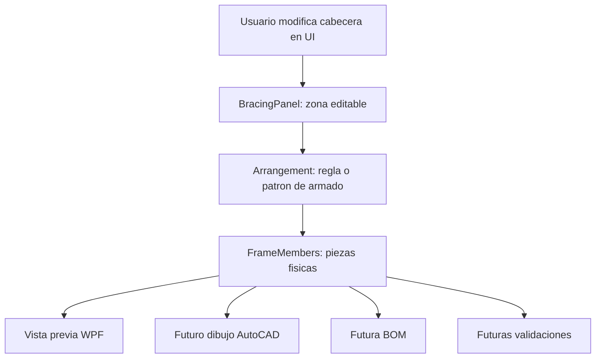
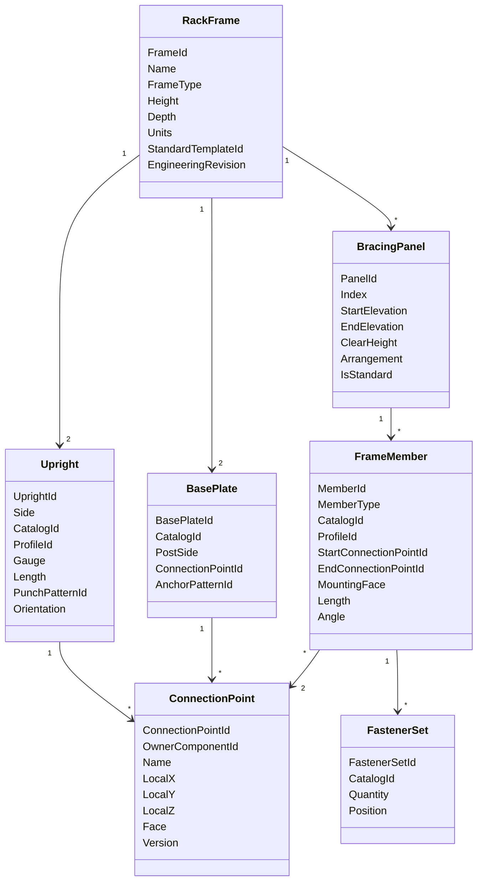

> Estado: documento histórico de una etapa previa. Para el estado vigente ver docs/00-indice-contexto.md y docs/01-estado-actual-mvp.md.

# Modelo de datos propuesto para cabeceras de rack selectivo convencional

Fecha: 2026-06-05

## 1. Objetivo del documento

Este documento propone una evolucion conceptual del modelo de datos para representar una cabecera real de rack selectivo convencional dentro de la aplicacion RackCad.

El objetivo no es cambiar codigo inmediatamente. El objetivo es definir una base tecnica para que, antes de avanzar a dibujo real en AutoCAD, bloques, BOM, SQLite o integraciones, el sistema tenga una representacion mas fiel de la cabecera fisica.

La idea principal es separar tres niveles:

1. Modelo fisico: piezas reales que existen en la cabecera.
2. Modelo de configuracion: agrupaciones utiles para que el usuario configure rapido.
3. Modelo de dibujo: instrucciones derivadas del modelo fisico para vista previa WPF y, mas adelante, AutoCAD.

## 2. Problema del modelo actual

El MVP actual utiliza conceptos como:

- Tramo.
- Patron.
- Lado: Front, Rear, Both, None.
- Perfil.
- Punto inicial.
- Punto final.

Estos conceptos han sido utiles para validar la experiencia de configuracion, pero algunos pertenecen mas a la interfaz que a la cabecera fisica.

En una cabecera real de rack selectivo convencional no existe fisicamente una pieza llamada "tramo". Lo que existe son piezas como:

- Poste izquierdo.
- Poste derecho.
- Placas base.
- Diagonales.
- Horizontales.
- Refuerzos.
- Tornillos o pernos.
- Anclas.
- Puntos de conexion.
- Troqueles o perforaciones.

Por lo tanto, el modelo tecnico final no deberia depender exclusivamente de "tramos con patrones". Ese enfoque puede ser comodo para configurar, pero puede volverse debil cuando se necesite:

- Dibujar piezas reales.
- Generar BOM.
- Validar longitudes.
- Validar puntos de conexion.
- Cambiar perfiles por pieza.
- Representar refuerzos reales.
- Editar o regenerar la cabecera desde metadatos.

## 3. Lectura critica del modelo actual

### 3.1 Conceptos que si representan elementos reales

| Concepto actual | Evaluacion | Comentario |
|---|---|---|
| `RackFrameConfiguration` | Valido | Representa la cabecera como ensamble general. |
| `PostAssembly` | Valido pero incompleto | Representa un poste, aunque deberia evolucionar hacia `Upright`. |
| `BasePlatePlacement` | Valido pero incompleto | Representa una placa base asociada a un poste. |
| `StartConnectionPointId` | Valido pero debil | Debe evolucionar a referencia formal a un punto de conexion. |
| `EndConnectionPointId` | Valido pero debil | Igual que el punto inicial. |
| `BraceProfileId` | Valido como dato de pieza | Actualmente esta ubicado en el tramo; deberia pertenecer a cada miembro fisico. |

### 3.2 Conceptos artificiales o heredados de la UI

| Concepto actual | Problema | Recomendacion |
|---|---|---|
| `BracingSegment` | No es pieza fisica; es zona editable. | Renombrar conceptualmente como `BracingPanel`. |
| `BracingPattern` | No es pieza; es regla de armado. | Usarlo como plantilla o arreglo que genera miembros fisicos. |
| `FrameSide` | Puede ser real, pero el nombre es ambiguo. | Evolucionar a `MountingFace`, `BracePlane` o `ConnectionFace`. |
| Perfil por tramo | Un tramo no tiene perfil fisico. | Mover perfil a cada diagonal, horizontal o refuerzo. |
| Punto inicial/final por tramo | Un panel puede tener varios miembros y varios puntos. | Mover puntos a cada miembro fisico. |

## 4. Principio de diseno propuesto

La cabecera debe modelarse como un ensamble de componentes reales.

El usuario puede seguir configurando por tramos o paneles, porque eso es rapido y natural. Pero internamente el sistema debe poder convertir esos paneles en piezas reales.

Principio:

> El configurador puede editar paneles, pero el modelo tecnico debe conocer miembros fisicos.

Flujo recomendado:



## 5. Modelo conceptual recomendado



## 6. Entidades propuestas

## 6.1 RackFrame

Representa la cabecera completa como ensamble.

Propiedades sugeridas:

| Propiedad | Descripcion |
|---|---|
| `FrameId` | Identificador unico de la cabecera. |
| `Name` | Nombre visible de la configuracion. |
| `FrameType` | Tipo de cabecera: Selective, DriveIn, PushBack, etc. |
| `Height` | Altura objetivo de la cabecera. |
| `Depth` | Fondo de la cabecera. |
| `Units` | Unidad de trabajo: in, mm, etc. |
| `StandardTemplateId` | Plantilla estandar de origen. |
| `StandardTemplateVersion` | Version de plantilla usada. |
| `EngineeringRevision` | Revision de ingenieria del modelo configurado. |
| `Uprights` | Postes que forman la cabecera. |
| `BasePlates` | Placas base asociadas a los postes. |
| `BracingPanels` | Zonas verticales de celosia/configuracion. |
| `Members` | Piezas reales: diagonales, horizontales, refuerzos. |
| `ConnectionPoints` | Puntos de conexion disponibles o usados. |
| `Fasteners` | Tornilleria, pernos o anclas asociadas. |
| `Overrides` | Excepciones respecto al estandar. |

## 6.2 Upright

Representa un poste fisico de la cabecera.

Propiedades sugeridas:

| Propiedad | Descripcion |
|---|---|
| `UprightId` | Identificador unico del poste. |
| `Side` | Left o Right. |
| `CatalogId` | Id del componente en catalogo. |
| `ProfileId` | Perfil estructural del poste, por ejemplo Omega 3x3. |
| `Description` | Descripcion comercial o tecnica. |
| `Gauge` | Calibre o espesor. |
| `Length` | Largo fisico del poste. |
| `PunchPatternId` | Patron de troqueles/perforaciones. |
| `Orientation` | Orientacion dentro de la cabecera. |
| `LocalCoordinateSystem` | Sistema local para ubicar puntos. |
| `ConnectionPoints` | Puntos asociados al poste. |
| `BasePlateId` | Placa base asociada. |
| `ReinforcementAssemblyId` | Refuerzo asociado, si existe. |

El refuerzo no deberia ser solo un booleano. Puede existir un booleano para UI rapida, pero el modelo fisico deberia tener una entidad de refuerzo.

## 6.3 BasePlate

Representa la placa base fisica.

Propiedades sugeridas:

| Propiedad | Descripcion |
|---|---|
| `BasePlateId` | Identificador de la placa dentro de la cabecera. |
| `CatalogId` | Id de catalogo de la placa. |
| `PostSide` | Poste al que pertenece: Left o Right. |
| `ConnectionPointId` | Punto de union al poste. |
| `AnchorPatternId` | Patron de anclaje. |
| `Width` | Ancho fisico. |
| `Depth` | Fondo fisico. |
| `Thickness` | Espesor. |
| `HolePattern` | Perforaciones/anclas. |
| `FastenerSetId` | Tornilleria o anclas asociadas. |

## 6.4 BracingPanel

Reemplaza conceptualmente al `Tramo`.

Un panel no es una pieza fisica. Es una zona vertical de armado entre dos elevaciones.

Propiedades sugeridas:

| Propiedad | Descripcion |
|---|---|
| `PanelId` | Identificador del panel. |
| `Index` | Orden vertical del panel. |
| `StartElevation` | Elevacion inicial. |
| `EndElevation` | Elevacion final. |
| `ClearHeight` | Claro del panel. |
| `PanelType` | Standard, Passage, Open, Custom, etc. |
| `Arrangement` | SingleDiagonal, DoubleDiagonal, X, K, HorizontalOnly, None, Custom. |
| `DefaultMemberProfileId` | Perfil sugerido por defecto, no obligatorio. |
| `DefaultMountingFace` | Cara sugerida por defecto. |
| `Members` | Miembros fisicos generados o asignados al panel. |
| `IsStandard` | Indica si coincide con la plantilla base. |
| `Overrides` | Cambios manuales respecto al estandar. |

El panel permite mantener una experiencia rapida de configuracion:

- Panel de 44 in estandar.
- Panel de 70 in por paso.
- Panel sin celosia.
- Panel con doble celosia.
- Panel horizontal.

Pero el resultado tecnico debe ser una lista de miembros fisicos.

## 6.5 FrameMember

Representa una pieza fisica dibujable y cotizable.

Tipos esperados:

- `DiagonalBrace`.
- `HorizontalBrace`.
- `UprightReinforcement`.
- `PlateReinforcement`.
- `SpecialMember`.

Propiedades sugeridas:

| Propiedad | Descripcion |
|---|---|
| `MemberId` | Identificador unico del miembro. |
| `MemberType` | Diagonal, Horizontal, Refuerzo, Especial. |
| `CatalogId` | Id del componente en catalogo. |
| `ProfileId` | Perfil fisico de la pieza. |
| `SourcePanelId` | Panel que origino este miembro. |
| `StartConnectionPointId` | Punto de conexion inicial. |
| `EndConnectionPointId` | Punto de conexion final. |
| `StartComponentId` | Componente propietario del punto inicial. |
| `EndComponentId` | Componente propietario del punto final. |
| `MountingFace` | Cara/plano de montaje. |
| `Length` | Longitud calculada o catalogada. |
| `Angle` | Angulo de colocacion. |
| `CutLength` | Longitud de corte, si aplica. |
| `FastenerSetId` | Tornilleria asociada. |
| `IsStandard` | Coincide con estandar. |
| `Notes` | Observaciones de ingenieria. |

Este es el elemento que mas adelante debe alimentar:

- Vista previa tecnica.
- Dibujo AutoCAD.
- BOM.
- Cotizacion.
- Validaciones de interferencia y consistencia.

## 6.6 ConnectionPoint

Representa un punto formal de conexion.

Debe evitar que offsets como `X = 2.75 in` o `Y = 7.58 in` queden hardcodeados.

Propiedades sugeridas:

| Propiedad | Descripcion |
|---|---|
| `ConnectionPointId` | Id unico, por ejemplo `TroquelCelosia_01`. |
| `OwnerComponentId` | Componente al que pertenece: poste, placa, refuerzo, etc. |
| `OwnerComponentType` | Tipo de componente propietario. |
| `Name` | Nombre humano del punto. |
| `LocalX` | Coordenada local X. |
| `LocalY` | Coordenada local Y. |
| `LocalZ` | Coordenada local Z, si aplica. |
| `Elevation` | Elevacion global derivada, si aplica. |
| `Face` | Cara del componente: Front, Rear, Interior, Exterior. |
| `HolePatternId` | Patron de perforacion asociado. |
| `AllowedMemberTypes` | Tipos de miembros que pueden conectarse. |
| `Version` | Version del punto o del patron de perforacion. |
| `IsActive` | Si esta disponible en catalogo actual. |

Ejemplo conceptual:

| Punto | X | Y | Face | Uso |
|---|---:|---:|---|---|
| `TroquelCelosia_01` | 2.75 in | 7.58 in | Interior | Diagonal/Horizontal |
| `TroquelCelosia_02` | 2.75 in | 11.58 in | Interior | Diagonal/Horizontal |
| `PlacaBase_01` | 0.00 in | 0.00 in | Bottom | Placa base |

## 6.7 FastenerSet

Representa tornilleria, pernos o anclas.

Propiedades sugeridas:

| Propiedad | Descripcion |
|---|---|
| `FastenerSetId` | Identificador del conjunto. |
| `CatalogId` | Id de tornillo/perno/ancla en catalogo. |
| `Quantity` | Cantidad. |
| `Diameter` | Diametro. |
| `Length` | Longitud. |
| `Grade` | Grado o especificacion. |
| `ConnectionId` | Conexion asociada. |
| `Position` | Punto o patron donde se coloca. |

## 7. Sobre Front, Rear, Both y None

El concepto actual `FrameSide` puede seguir existiendo durante el MVP porque ayuda mucho al usuario. Sin embargo, para un modelo tecnico mas robusto conviene precisar su significado.

Posibles nombres futuros:

| Nombre | Uso recomendado |
|---|---|
| `MountingFace` | Cara fisica donde se monta una pieza. |
| `BracePlane` | Plano de celosia dentro de la cabecera. |
| `ConnectionFace` | Cara del punto de conexion. |

Para racks selectivos convencionales, puede haber celosia:

- En la cara frontal.
- En la cara posterior.
- En ambas.
- En ninguna.

Pero el miembro fisico individual deberia tener una cara concreta. Si se selecciona `Both`, el sistema puede generar dos miembros equivalentes, uno en `Front` y otro en `Rear`.

Ejemplo:

```text
Panel 2
Arrangement: DoubleDiagonal
SideMode: Both

Genera:
- DiagonalBrace Front A
- DiagonalBrace Front B
- DiagonalBrace Rear A
- DiagonalBrace Rear B
```

## 8. Sobre patrones de celosia

`BracingPattern` no deberia ser tratado como pieza. Debe ser una instruccion o arreglo.

Ejemplos:

| Arrangement | Miembros generados |
|---|---|
| `None` | Ningun miembro de celosia. |
| `HorizontalOnly` | Un `HorizontalBrace`. |
| `SingleDiagonal` | Un `DiagonalBrace`. |
| `DoubleDiagonal` | Dos `DiagonalBrace`. |
| `X` | Dos `DiagonalBrace` cruzadas. |
| `K` | Varios `DiagonalBrace` conectados a punto intermedio. |
| `Custom` | Miembros definidos manualmente. |

Esto permite que el usuario siga pensando en patrones, mientras el sistema guarda piezas reales.

## 9. Modelo recomendado para el MVP actual

No se recomienda eliminar el concepto de tramo en este momento. La tabla y el panel de propiedades ya funcionan como una forma rapida de configurar.

Recomendacion:

| Nivel | Nombre en UI | Nombre tecnico recomendado | Rol |
|---|---|---|---|
| UI | Tramo | `BracingPanel` | Zona editable de celosia. |
| Regla | Patron | `BracingArrangement` | Intencion de armado. |
| Pieza | Diagonal/Horizontal | `FrameMember` | Componente fisico. |
| Punto | Punto inicial/final | `ConnectionPointRef` | Referencia formal a conexion. |

Asi se conserva la velocidad del MVP, pero se prepara el sistema para dibujo real y BOM.

## 10. Ejemplo de transformacion conceptual

Entrada del usuario:

```text
Tramo 2
Claro: 70 in
Patron: SingleDiagonal
Lado: Front
Perfil: TRAVESANO_PARA_POSTE_OMEGA_DE_CINTA_CALIBRE_14
Punto inicial: TroquelCelosia_01
Punto final: TroquelCelosia_02
```

Modelo tecnico recomendado:

```text
BracingPanel
- Index: 2
- StartElevation: 44 in
- EndElevation: 114 in
- ClearHeight: 70 in
- Arrangement: SingleDiagonal
- DefaultMountingFace: Front

FrameMember
- Type: DiagonalBrace
- ProfileId: TRAVESANO_PARA_POSTE_OMEGA_DE_CINTA_CALIBRE_14
- SourcePanelId: Panel 2
- MountingFace: Front
- StartConnectionPointId: TroquelCelosia_01
- EndConnectionPointId: TroquelCelosia_02
```

Si el usuario cambia el lado a `Both`, no debe cambiar solo una propiedad visual. Debe generar dos miembros fisicos:

```text
FrameMember 1: DiagonalBrace Front
FrameMember 2: DiagonalBrace Rear
```

## 11. Reglas de propiedad: donde debe vivir cada dato

| Dato | Debe vivir en |
|---|---|
| Altura total | `RackFrame`. |
| Fondo | `RackFrame`. |
| Perfil de poste | `Upright`. |
| Refuerzo de poste | `UprightReinforcement` o `FrameMember`. |
| Placa base | `BasePlate`. |
| Claro vertical editable | `BracingPanel`. |
| Patron de celosia | `BracingArrangement` dentro de `BracingPanel`. |
| Perfil de diagonal | `FrameMember`. |
| Perfil de horizontal | `FrameMember`. |
| Punto inicial/final de una pieza | `FrameMember`. |
| Coordenadas de troqueles | `ConnectionPoint`. |
| Tornillos | `FastenerSet`. |
| Excepcion contra estandar | `Override` asociado al elemento cambiado. |

## 12. Impacto en la vista previa WPF

La vista previa WPF debe empezar a dibujar desde una estructura equivalente a `FrameMember`, aunque todavia sea simplificada.

Esto es importante porque la vista previa debe validar la logica de armado, no solo decorar la pantalla.

Recomendacion:

```text
RackFrame
  -> BracingPanels
  -> FrameMembers derivados
  -> PreviewDrawingPlan
  -> Canvas WPF
```

Mas adelante:

```text
RackFrame
  -> BracingPanels
  -> FrameMembers derivados
  -> AutoCadDrawingPlan
  -> Entidades AutoCAD
```

El objetivo es que WPF y AutoCAD compartan el mismo modelo conceptual.

## 13. Impacto futuro en BOM

La BOM no debe salir de paneles. Debe salir de piezas.

Incorrecto:

```text
Panel 2 = SingleDiagonal
```

Correcto:

```text
1 diagonal de cinta calibre 14, longitud X
2 tornillos tipo Y
1 horizontal de cinta calibre 14, longitud Z
```

Por eso `FrameMember` es fundamental antes de construir una BOM seria.

## 14. Migracion gradual recomendada

### Fase 1: mantener MVP actual

Mantener:

- Tabla de tramos.
- Panel de propiedades.
- Vista previa WPF.
- Modelo `BracingSegment`.

Pero documentar que `BracingSegment` representa temporalmente un `BracingPanel`.

### Fase 2: introducir `BracingPanel`

Crear entidad tecnica equivalente a tramo:

- `PanelId`.
- `StartElevation`.
- `EndElevation`.
- `ClearHeight`.
- `Arrangement`.
- `Members`.

La UI puede seguir diciendo "Tramo".

### Fase 3: derivar `FrameMember`

Crear una transformacion:

```text
BracingPanel + Arrangement + ConnectionPoints -> FrameMembers
```

En esta fase la vista previa WPF deberia empezar a pintar desde miembros fisicos.

### Fase 4: formalizar puntos de conexion

Crear catalogo versionado de puntos:

- Troqueles de poste.
- Puntos de placa.
- Puntos para horizontales.
- Puntos de refuerzo.

### Fase 5: preparar dibujo AutoCAD simple

Generar lineas basicas desde `FrameMember`, sin bloques.

### Fase 6: preparar BOM preliminar

Agrupar `FrameMembers`, `BasePlates`, `Uprights` y `FastenerSets`.

### Fase 7: pasar a bloques y catalogos reales

Una vez validado el modelo fisico, mapear cada componente a:

- Bloque.
- Capa.
- Catalogo.
- Propiedades.
- Metadatos.

## 15. Riesgos de mantener solo el modelo por tramos

Si el sistema se queda demasiado tiempo en un modelo de "tramos con patron", pueden aparecer estos problemas:

- Dificultad para calcular longitudes reales de diagonales.
- Dificultad para dibujar doble celosia en ambos lados.
- BOM incompleta o artificial.
- Perfiles asignados al lugar incorrecto.
- Problemas al representar refuerzos.
- Dificultad para editar una pieza especifica.
- Dificultad para versionar puntos de conexion.
- Dificultad para regenerar dibujos existentes.

## 16. Recomendacion final

El modelo actual es adecuado como prototipo de UX, pero antes de avanzar fuerte en AutoCAD conviene evolucionar hacia un modelo orientado a componentes reales.

La estructura recomendada es:

```text
RackFrame
├── Uprights
├── BasePlates
├── BracingPanels
│   └── FrameMembers
├── ConnectionPoints
├── FastenerSets
└── Overrides
```

El usuario puede seguir trabajando con "tramos", porque es rapido. Pero internamente cada tramo debe entenderse como un panel de celosia que genera piezas reales.

La regla de oro:

> Configurar por paneles, guardar por componentes, dibujar por miembros fisicos.

