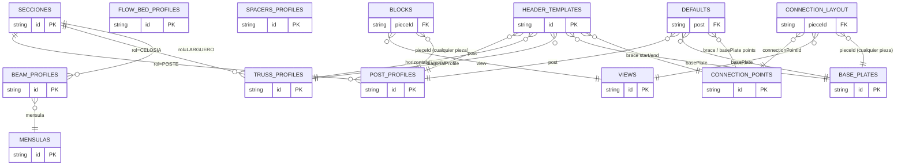

# Modelo de datos: cómo se conectan los catálogos

Esta guía explica **qué tabla apunta a cuál** (las "conexiones" entre los CSV/JSON) y **cómo se cargan**
en el código. Es el mapa para entender por qué existen `blocks`, `views`, `secciones`, etc.

RackCad ya no es "solo un configurador de cabeceras": dibuja en AutoCAD los **cuatro** tipos de rack
(cabecera/marco, sistema dinámico, cama de rodamiento y selectivo), y todos comparten este mismo catálogo.
Los CSV se editan en Excel; el provider los carga a un único `RackCatalog` que consumen los editores y
los servicios de dibujo.

## 1. Las tablas y su clave

Cada archivo es una "tabla". La columna `id` es la **clave primaria** (lo que otras tablas referencian).

| Tabla (archivo) | Clave | ¿Referencia a otras? |
|---|---|---|
| `secciones.csv` | `id` | → `mensulas` (columna `mensula`, solo en filas `rol=LARGUERO`); la columna `rol` = POSTE\|CELOSIA\|LARGUERO parte esta hoja única en postes/refuerzos, celosía (horizontales y diagonales) y largueros; `peraltes` (largueros) = valores permitidos (no FK) |
| `mensulas.csv` | `id` | No (catálogo hoja; conector de extremo del larguero) |
| `flow-bed-profiles.csv` | `id` | No (componentes de cama: riel/rodillo/freno/tope por `role`) |
| `secciones.csv` (rol `SEPARADOR`) | `id` | Sí — el perfil del separador de cabecera se carga en `RackCatalog.SpacerProfiles` |
| `connection-points.csv` | `id` | No (solo define qué es el punto) |
| `views.csv` | `id` | No |
| `base-plates.csv` | `id` | No (posición de puntos → `connection-layout`; `peralteBase`/`peraltePorPeraltePoste` = peralte estándar derivado del poste) |
| `connection-layout.csv` | `pieceId`+`connectionPointId`+`view` | → cualquier pieza, → `connection-points` **y** → `views` |
| `blocks.csv` | `pieceId`+`view` | → cualquier pieza **y** → `views` |
| `header-templates.json` | `id` | → perfiles, placa y puntos |
| `defaults.json` | (única) | → perfiles, placa y puntos |

> **Nota (compatibilidad):** los tres CSV separados `post-profiles.csv`, `truss-profiles.csv` y
> `beam-profiles.csv` son **fallback legacy** (mismos `id` y mismos campos que las filas de `secciones.csv`).
> Solo se leen si **falta** `secciones.csv`; con la hoja unificada presente se ignoran.

Las **hojas** (perfiles, puntos, vistas) no dependen de nadie: son el vocabulario base.
Las que **referencian** (placas, bloques, plantillas, defaults) reutilizan esos `id`.

## 2. Diagrama de relaciones (quién apunta a quién)

```
        CATÁLOGOS HOJA (clave = id, no dependen de nadie)
        ┌──────────────────────┐ ┌────────────────────────┐ ┌───────────────┐
        │ secciones.csv        │ │ secciones.csv          │ │ views.csv     │
        │ rol=POSTE            │ │ rol=CELOSIA (h/diag)   │ │ (FRONTAL,     │
        │ (POSTE_*, refuerzos) │ │ connection-points.csv  │ │  PLANTA, ...) │
        └──────────▲───────────┘ └───────────▲────────────┘ └───────▲───────┘
                   │                          │                      │
   ┌───────────────┼──────────────┬───────────┼──────────┐           │
   │               │              │           │          │           │
   │   connection-layout.csv      │           │          │           │
   │   ─ connectionPointId ───────┼───────────┘          │           │
   │   ─ pieceId ─► cualquier pieza   ─ view ─► views.csv │           │
   │     (placa/poste/...) · posición 2D por vista        │           │
   │   blocks.csv                 │                                  │
   │   ─ pieceId ─► CUALQUIER pieza (post/horizontal/diagonal/       │
   │   │            refuerzo/placa/punto), por su id ────────────────┘ (no)
   │   ─ view    ─► views.csv (id) ───────────────────────────────────┘
   │
   │   header-templates.json            defaults.json
   │   ─ post                ─► post-profiles        ─ post                ─► post-profiles
   │   ─ horizontals[].profile ─► truss-profiles     ─ horizontalProfile  ─► truss-profiles
   │   ─ diagonalProfile     ─► truss-profiles       ─ diagonalProfile     ─► truss-profiles
   │   ─ basePlate           ─► base-plates          ─ basePlate           ─► base-plates
   │   ─ braceStart/EndConnectionPoint ─► connection-points
   │                                                 ─ brace*/basePlateConnectionPoint ─► connection-points
   └───────────────────────────────────────────────────────────────────────────────────────
```

> Los recuadros `post-profiles` / `truss-profiles` de arriba son en realidad **slices** de
> `secciones.csv`: `rol=POSTE` (postes y refuerzos), `rol=CELOSIA` (horizontales y diagonales) y
> `rol=LARGUERO` (largueros, con su columna `mensula`). Las FK que este documento escribe como
> `-> post-profiles` / `-> truss-profiles` se resuelven contra esos slices; los `id` **no cambiaron**,
> así que plantillas y `defaults` siguen apuntando a los mismos `id`.

Resumen de las **claves foráneas** (FK), una por una:

- `blocks.pieceId` → el `id` de cualquier pieza (perfil, placa, punto, larguero, ménsula, rodillo…)
- `blocks.view` → `views.id`
- `beam-profiles.mensula` → `mensulas.id` (conector de extremo del larguero)
- `connection-layout.pieceId` → el `id` de cualquier pieza (p. ej. una placa)
- `connection-layout.connectionPointId` → `connection-points.id`
- `connection-layout.view` → `views.id`
- `connection-layout.paramX` / `paramY` → nombre de un parámetro del bloque (posición paramétrica por eje:
  `X = localX + localXPorParam * valor(paramX)` e `Y = localY + localYPorParam * valor(paramY)`; vacío = punto fijo en ese eje)
- `header-templates.post` → `post-profiles.id`
- `header-templates.horizontals[].profile` → `truss-profiles.id`
- `header-templates.diagonalProfile` → `truss-profiles.id`
- `header-templates.basePlate` → `base-plates.id`
- `header-templates.braceStartConnectionPoint` / `braceEndConnectionPoint` → `connection-points.id`
- `defaults.post` / `basePlate` / `diagonalProfile` / `horizontalProfile` → su catálogo
- `defaults.braceStartConnectionPoint` / `braceEndConnectionPoint` / `basePlateConnectionPoint` → `connection-points.id`

Mismo diagrama en formato Mermaid (se ve en GitHub/VS Code):



## 3. Cómo se cargan (flujo en el código)

Todo entra por **un solo punto**: el provider lee la carpeta `catalogs/` y devuelve un objeto
`RackCatalog` con todas las listas ya cargadas.

```
JsonRackCatalogProvider.FromBaseDirectory().Load()
   │   (Excel-first: lee cada .csv; si no hay, el .json hermano)
   │
   │   secciones.csv --SplitSecciones(rol)--> PostProfiles  (filas rol=POSTE)
   │                                          TrussProfiles (filas rol=CELOSIA)
   │                                          BeamProfiles  (filas rol=LARGUERO, +Mensula)
   │   (si falta secciones.csv -> lee post-/truss-/beam-profiles legacy en su lugar)
   ▼
RackCatalog {
   PostProfiles, TrussProfiles,
   BasePlates, FlowBedProfiles, BeamProfiles, Mensulas,
   ConnectionPoints, ConnectionLayout, Views, Blocks,
   Defaults
}
```

(El perfil del separador de cabecera vive en `secciones.csv` con rol `SEPARADOR`; el provider lo carga en
`RackCatalog.SpacerProfiles`. El antiguo `spacers-profiles.csv` — huérfano, nunca leído — se eliminó.)

Las **plantillas** se cargan aparte (son JSON anidado):

```
RackFrameTemplateProvider  ─►  lista de RackFrameTemplate  (header-templates.json)
```

Y aquí es donde las conexiones se **resuelven** (los `id` se convierten en piezas reales):

```
RackFrameConfigurationFactory.Build(plantilla, post, alto, fondo)
   por cada id de la plantilla (post, profiles, basePlate, puntos):
        ¿viene vacío en la plantilla?  ──► usa defaults.json
        busca ese id en RackCatalog    (FindProfile / FindBasePlate / FindConnectionPoint)
   ─►  RackFrameConfiguration  =  la cabecera concreta con sus miembros resueltos
```

La fase de **dibujo** ya está implementada para los cuatro tipos de rack (cada uno con su servicio de
dibujo) y cierra el círculo usando `blocks` + `views`:

```
por cada miembro del rack y cada vista a dibujar:
   catalog.Blocks.FindBlock(pieceId, view)
        ─► blockName + layer + scale + rotation
        ─► insertar ese bloque en AutoCAD
```

Vistas por tipo: el selectivo dibuja FRONTAL + LATERAL + PLANTA (tres vistas ligadas por el mismo GUID;
el lateral es un corte por poste, cada corte es su propio bloque); la cabecera dibuja LATERAL + PLANTA;
sistema dinámico y cama dibujan LATERAL. Las vistas lateral/planta solo se insertan desde `RACKEDITAR`
de una vista existente, para que nunca queden huérfanas.
Cada vista dibujada es UNA definición de bloque con un sobre `RackEmbedDocument` embebido (SchemaVersion +
Kind + View + Section + Id + Name + Design JSON; `Section` es el índice de corte lateral del selectivo,
`-1` si la vista no es seccionada); `RACKEDITAR` lo relee, despacha por Kind, reabre el editor del sistema
completo y al confirmar redibuja TODAS las vistas del mismo GUID (las encuentra escaneando las definiciones
de bloque), redefiniendo cada definición en sitio para que todas las copias se actualicen a la vez.

## 4. Ejemplo trazado de punta a punta

Quiero dibujar la cabecera estándar en vista lateral (la cabecera dibuja LATERAL + PLANTA; `FRONTAL`
es del selectivo). El ejemplo ilustra sobre todo cómo se **resuelven los `id`**; la vista concreta solo
cambia qué fila de `connection-layout`/`blocks` se elige:

1. `Load()` lee todo → `RackCatalog`.
2. Tomo la plantilla `STD-3P`. Su campo `post` = `POSTE_OMEGA_ATORNILLABLE_CON_TROQUEL_GOTA_DE_AGUA`.
3. `FindProfile("POSTE_OMEGA_ATORNILLABLE_CON_TROQUEL_GOTA_DE_AGUA")` en `secciones.csv` (filas `rol=POSTE`) → la pieza con su `width`, `material`, etc.
4. Su `basePlate` = `PLACA_BASE_DE_CABECERA_ATORNILLABLE_DE_PLACA_CALIBRE_3_16`. ¿Dónde se monta? `MountConnectionPointId("PLACA_BASE_DE_CABECERA_ATORNILLABLE_DE_PLACA_CALIBRE_3_16")`
   busca en `connection-layout.csv` la fila de esa placa con rol `BasePlate` → `MONTAJE_POSTE`. Luego
   `FindConnectionLayout("PLACA_BASE_DE_CABECERA_ATORNILLABLE_DE_PLACA_CALIBRE_3_16","MONTAJE_POSTE","LATERAL")` → `localX/localY` para el mate.
   (`MONTAJE_POSTE` es compartible: cualquier placa lo usa con su propia posición por vista, sin tocar la fila de la placa.)
5. (Dibujo) Para ese poste en vista `LATERAL`: `Blocks.FindBlock("POSTE_OMEGA_ATORNILLABLE_CON_TROQUEL_GOTA_DE_AGUA","LATERAL")`
   → `blockName = POSTE_OMEGA_ATORNILLABLE_CON_TROQUEL_GOTA_DE_AGUA_LATERAL` → se inserta en AutoCAD.

## 5. Reglas para mantener la integridad

- Un `id` que una tabla referencia **debe existir** en la tabla destino (si no, no se resuelve).
- Borrar una pieza referenciada por una plantilla/`defaults`/`blocks` deja esa referencia "colgando".
- La prueba `CatalogStandardConsistencyTests` verifica que la cabecera estándar no apunte a `id` inexistentes.
- Si un requisito futuro justificara migrar el catálogo a una base de datos, estas relaciones pasarían a claves
  foráneas reales. SQLite no forma parte del alcance actual.

## 6. Dónde está en el código

- Carga y modelo de catálogos: `src/RackCad.Application/Catalogs/` (`JsonRackCatalogProvider`,
  `CsvCatalogReader`, `CatalogEntries` —incluye `RackCatalog`—, `RackCatalogExtensions`, `RackDefaults`).
- Carga de plantillas: `src/RackCad.Application/RackFrames/RackFrameTemplateProvider.cs`
  (fallback en `RackFrameTemplateCatalog`).
- Resolución plantilla+defaults+catálogo → cabecera: `RackFrameConfigurationFactory.cs`.
- Comandos de AutoCAD (menú y dibujo por tipo): `src/RackCad.Plugin/RackFrameCommands.cs`
  (`RACKCAD`, `RACKCABECERA`, `QUICKCABECERA`, `RACKSISTEMADINAMICO`, `QUICKCAMA`,
  `RACKSELECTIVO`, `RACKEDITAR`, `RACKDUPLICAR`).
- Inventario de racks del dibujo (tabla de todos los racks con zoom al elegido): `RACKLISTA`
  en `src/RackCad.Plugin/RackFrameCommands.List.cs`.
