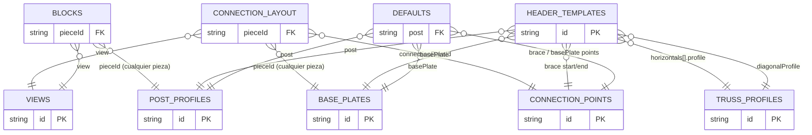

# Modelo de datos: cómo se conectan los catálogos

Esta guía explica **qué tabla apunta a cuál** (las "conexiones" entre los CSV/JSON) y **cómo se cargan**
en el código. Es el mapa para entender por qué existen `blocks`, `views`, `post-profiles`, etc.

## 1. Las tablas y su clave

Cada archivo es una "tabla". La columna `id` es la **clave primaria** (lo que otras tablas referencian).

| Tabla (archivo) | Clave | ¿Referencia a otras? |
|---|---|---|
| `post-profiles.csv` | `id` | No (catálogo hoja) |
| `truss-profiles.csv` | `id` | No (horizontales y diagonales; los refuerzos usan `post-profiles.csv`) |
| `connection-points.csv` | `id` | No (solo define qué es el punto) |
| `views.csv` | `id` | No |
| `base-plates.csv` | `id` | No (su posición de puntos va en `connection-layout`) |
| `connection-layout.csv` | `pieceId`+`connectionPointId`+`view` | → cualquier pieza, → `connection-points` **y** → `views` |
| `blocks.csv` | `pieceId`+`view` | → cualquier pieza **y** → `views` |
| `header-templates.json` | `id` | → perfiles, placa y puntos |
| `defaults.json` | (única) | → perfiles, placa y puntos |

Las **hojas** (perfiles, puntos, vistas) no dependen de nadie: son el vocabulario base.
Las que **referencian** (placas, bloques, plantillas, defaults) reutilizan esos `id`.

## 2. Diagrama de relaciones (quién apunta a quién)

```
        CATÁLOGOS HOJA (clave = id, no dependen de nadie)
        ┌──────────────────────┐ ┌────────────────────────┐ ┌───────────────┐
        │ post-profiles.csv    │ │ truss-profiles.csv     │ │ views.csv     │
        │ (POSTE_*, refuerzos) │ │ (horizontales/diag.)   │ │ (FRONTAL,     │
        │                      │ │ connection-points.csv  │ │  PLANTA, ...) │
        └──────────▲───────────┘ └───────────▲────────────┘ └───────▲───────┘
                   │                          │                      │
   ┌───────────────┼──────────────┬───────────┼──────────┐           │
   │               │              │           │          │           │
   │   connection-layout.csv      │           │          │           │
   │   ─ connectionPointId ───────┼───────────┘          │           │
   │   ─ pieceId ─► cualquier pieza   ─ view ─► views.csv │           │
   │     (placa/poste/...) · posición 2D por vista        │           │
   │   blocks.csv                 │                                  │
   │   ─ pieceId ─► CUALQUIER pieza (post/horizontal/diagonal/       │
   │   │            refuerzo/placa/punto), por su id ────────────────┘ (no)
   │   ─ view    ─► views.csv (id) ───────────────────────────────────┘
   │
   │   header-templates.json            defaults.json
   │   ─ post                ─► post-profiles        ─ post                ─► post-profiles
   │   ─ horizontals[].profile ─► truss-profiles     ─ horizontalProfile  ─► truss-profiles
   │   ─ diagonalProfile     ─► truss-profiles       ─ diagonalProfile     ─► truss-profiles
   │   ─ basePlate           ─► base-plates          ─ basePlate           ─► base-plates
   │   ─ braceStart/EndConnectionPoint ─► connection-points
   │                                                 ─ brace*/basePlateConnectionPoint ─► connection-points
   └───────────────────────────────────────────────────────────────────────────────────────
```

Resumen de las **claves foráneas** (FK), una por una:

- `blocks.pieceId` → el `id` de cualquier pieza (perfil, placa o punto)
- `blocks.view` → `views.id`
- `connection-layout.pieceId` → el `id` de cualquier pieza (p. ej. una placa)
- `connection-layout.connectionPointId` → `connection-points.id`
- `connection-layout.view` → `views.id`
- `header-templates.post` → `post-profiles.id`
- `header-templates.horizontals[].profile` → `truss-profiles.id`
- `header-templates.diagonalProfile` → `truss-profiles.id`
- `header-templates.basePlate` → `base-plates.id`
- `header-templates.braceStartConnectionPoint` / `braceEndConnectionPoint` → `connection-points.id`
- `defaults.post` / `basePlate` / `diagonalProfile` / `horizontalProfile` → su catálogo
- `defaults.braceStartConnectionPoint` / `braceEndConnectionPoint` / `basePlateConnectionPoint` → `connection-points.id`

Mismo diagrama en formato Mermaid (se ve en GitHub/VS Code):



## 3. Cómo se cargan (flujo en el código)

Todo entra por **un solo punto**: el provider lee la carpeta `catalogs/` y devuelve un objeto
`RackCatalog` con todas las listas ya cargadas.

```
JsonRackCatalogProvider.FromBaseDirectory().Load()
   │   (lee cada .csv; si no hay, el .json)
   ▼
RackCatalog {
   PostProfiles, TrussProfiles,
   BasePlates, ConnectionPoints, Views, Blocks,
   Defaults
}
```

Las **plantillas** se cargan aparte (son JSON anidado):

```
RackFrameTemplateProvider  ─►  lista de RackFrameTemplate  (header-templates.json)
```

Y aquí es donde las conexiones se **resuelven** (los `id` se convierten en piezas reales):

```
RackFrameConfigurationFactory.Build(plantilla, post, alto, fondo)
   por cada id de la plantilla (post, profiles, basePlate, puntos):
        ¿viene vacío en la plantilla?  ──► usa defaults.json
        busca ese id en RackCatalog    (FindProfile / FindBasePlate / FindConnectionPoint)
   ─►  RackFrameConfiguration  =  la cabecera concreta con sus miembros resueltos
```

La fase de **dibujo** (aún pendiente) cerrará el círculo usando `blocks` + `views`:

```
[FUTURO]  por cada miembro de la cabecera y cada vista a dibujar:
   catalog.Blocks.FindBlock(pieceId, view)
        ─► blockName + layer + scale + rotation
        ─► insertar ese bloque en AutoCAD
```

## 4. Ejemplo trazado de punta a punta

Quiero dibujar la cabecera estándar en vista frontal:

1. `Load()` lee todo → `RackCatalog`.
2. Tomo la plantilla `STD-3P`. Su campo `post` = `POSTE_OMEGA_3_X_3_ATORNILLABLE_CON_TROQUEL_GOTA_DE_AGUA_DE_CINTA_NEGRA_CALIBRE_14`.
3. `FindProfile("POSTE_OMEGA_3_X_3_ATORNILLABLE_CON_TROQUEL_GOTA_DE_AGUA_DE_CINTA_NEGRA_CALIBRE_14")` en `post-profiles.csv` → la pieza con su `width`, `material`, etc.
4. Su `basePlate` = `PLACA_BASE_DE_CABECERA_ATORNILLABLE_DE_PLACA_CALIBRE_3_16_DE_4_X_4_13_16`. ¿Dónde se monta? `MountConnectionPointId("PLACA_BASE_DE_CABECERA_ATORNILLABLE_DE_PLACA_CALIBRE_3_16_DE_4_X_4_13_16")`
   busca en `connection-layout.csv` la fila de esa placa con rol `BasePlate` → `MONTAJE_POSTE`. Luego
   `FindConnectionLayout("PLACA_BASE_DE_CABECERA_ATORNILLABLE_DE_PLACA_CALIBRE_3_16_DE_4_X_4_13_16","MONTAJE_POSTE","FRONTAL")` → `localX/localY` para el mate.
   (`MONTAJE_POSTE` es compartible: cualquier placa lo usa con su propia posición. La placa puede tener más
   puntos —p. ej. `ANCLA_1`, `ANCLA_2` en `PLANTA`— sin tocar la fila de la placa.)
5. (Dibujo) Para ese poste en vista `FRONTAL`: `Blocks.FindBlock("POSTE_OMEGA_3_X_3_ATORNILLABLE_CON_TROQUEL_GOTA_DE_AGUA_DE_CINTA_NEGRA_CALIBRE_14","FRONTAL")`
   → `blockName = POSTE_OMEGA_3X3_FRONT`, capa `RACK-POSTES` → se inserta en AutoCAD.

## 5. Reglas para mantener la integridad

- Un `id` que una tabla referencia **debe existir** en la tabla destino (si no, no se resuelve).
- Borrar una pieza referenciada por una plantilla/`defaults`/`blocks` deja esa referencia "colgando".
- La prueba `CatalogStandardConsistencyTests` verifica que la cabecera estándar no apunte a `id` inexistentes.
- Cuando esto pase a SQLite, estas FK serán claves foráneas reales (mismo modelo, validación automática).

## 6. Dónde está en el código

- Carga y modelo de catálogos: `src/RackCad.Application/Catalogs/` (`JsonRackCatalogProvider`,
  `CsvCatalogReader`, `CatalogEntries`, `RackCatalogExtensions`).
- Carga de plantillas: `src/RackCad.Application/RackFrames/RackFrameTemplateProvider.cs`.
- Resolución plantilla+defaults+catálogo → cabecera: `RackFrameConfigurationFactory.cs`.
